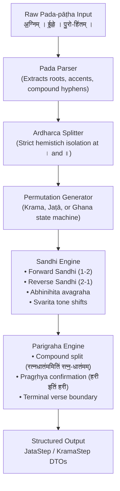

For over three millennia, the Vedic textual corpus—comprising tens of thousands of verses across the Ṛgveda, Yajurveda, Sāmaveda, and Atharvaveda—was transmitted entirely by oral tradition without the loss of a single syllable, vowel quantity, or pitch accent (*svara*).

This preservation was achieved not merely by rote repetition, but through an error-detecting checksum system: the **Prakṛti** (natural) and **Vikṛti** (permutational) **Pāṭhas**.

---

## 1. The Architectural Hierarchy

Vedic recitations fall into two overarching categories:

```text
Vedic Recitations
├── Prakṛti Pāṭhas (Natural forms)
│   ├── Saṃhitā-pāṭha (Continuous, sandhi-merged text)
│   ├── Pada-pāṭha    (Analyzed, word-by-word text)
│   └── Krama-pāṭha   (Stepped pairwise permutations)
└── Vikṛti Pāṭhas (Eight modified permutations based on Krama)
    ├── Jaṭā-pāṭha
    ├── Mālā-pāṭha
    ├── Śikhā-pāṭha
    ├── Rekhā-pāṭha
    ├── Dhvaja-pāṭha
    ├── Daṇḍa-pāṭha
    ├── Ratha-pāṭha
    └── Ghana-pāṭha
```

---

## 2. The Three Prakṛti Pāṭhas

### Saṃhitā-pāṭha (1 2 3 4 ... n)
The continuous, poetic form as chanted in ritual. Here, words are joined by natural euphonic combination (*sandhi*). Accents interact across word boundaries:

> अ॒ग्निमी॑ळे पु॒रोहि॑तं य॒ज्ञस्य॑ दे॒वमृ॒त्विज॑म् । होता॑रं रत्न॒धात॑मम् ॥
> (*agnim īḷe purohitaṃ yajñasya devam ṛtvijam | hotāraṃ ratnadhātamam ||*)

### Pada-pāṭha (1 | 2 | 3 | 4 ... n)
Attributed in the Ṛgveda tradition to the ancient grammarian Śākalya, the **Pada-pāṭha** isolates every word (*pada*) in its uncombined state. It resolves all external sandhi, reveals compound components using hyphens or avagrahah (`-` or `ऽ`), and isolates enclitics:

> अ॒ग्निम् । ई॒ळे॒ । पु॒रो-हि॑तम् । य॒ज्ञस्य॑ । दे॒वम् । ऋ॒त्विज॑म् । होता॑रम् । रत्न॒-धात॑मम् ॥

### Krama-pāṭha (1-2 | 2-3 | 3-4 ... n-iti)
The **Krama-pāṭha** ("step recitation") is the vital bridge between Prakṛti and Vikṛti forms. In Krama, padas are recited in overlapping adjacent pairs:

- Word 1 + Word 2
- Word 2 + Word 3
- Word 3 + Word 4
- ...
- Word (n-1) + Word n
- Word n + *iti* + Word n (Terminal Parigraha)

Every internal word is recited exactly twice: first as the second member of a pair, then as the first member of the subsequent pair. This overlapping chain makes it impossible to drop, insert, or transpose a single word without breaking the recitation chain.

```text
Hemistich 1:
Step 1: (1-2)    अ॒ग्निमी॑ळे
Step 2: (2-3)    ई॒ळे॒ पु॒रोहि॑तम्
Step 3: (3-Par)  पु॒रोहि॑तमिति॑ पु॒रो-हि॑तम्
Step 4: (3-4)    पु॒रोहि॑तं य॒ज्ञस्य॑
Step 5: (4-5)    य॒ज्ञस्य॑ दे॒वम्
Step 6: (5-6)    दे॒वमृ॒त्विज॑म्
Step 7: (6-Par)  ऋ॒त्विज॒मित्यृ॒त्विज॑म् ।

Hemistich 2:
Step 8: (7-8)    होता॑रं रत्न॒धात॑मम्
Step 9: (8-Par)  रत्न॒धात॑ममिति॑ रत्न॒-धात॑मम् ॥
```

---

## 3. The Parigraha Clause (*iti* / Sthita-Upasthita)

In Krama-pāṭha, certain words cannot simply be paired and left behind. They require an explicit closure clause known as **Parigraha** (or *Sthita-Upasthita* in the Prātiśākhyas).

Parigraha uses the particle **`इति॑`** (*iti*, accented with a canonical *svarita* on the second syllable):

### A. Terminal Words of a Verse
The final word (pada *n*) of a verse has no subsequent word to pair with. It is recited with Parigraha:
- Simple word: `पदम् + इति॑ + पदम्`
- Merged with *m*: `पु॒रोहि॑तम्` → `पु॒रोहि॑तमिति॑ पु॒रो-हि॑तम्`

### B. Compound Words (*Samāsa*)
When a compound word occurs at the end of a section or receives Parigraha, it is recited in **unified form**, followed by `इति॑`, followed by its **split analytical form**:

> **Unified** + **इति॑** + **Split**

Example from Ṛgveda 1.1.1 (pada 8: `रत्न॒-धात॑मम्`):
> रत्न॒धात॑ममिति॑ रत्न॒-धात॑मम्

### C. The Vedic Particle *u*
Pāṇini (1.1.13 *oteḥ*) records that the unaccented monosyllabic particle *u* undergoes nasalization and prolongation in the Pada/Krama tradition:
> ऊँ॒ इति॑ उ

---

## 4. Pragṛhya Vowels & Sandhi Immunity

Normally in Sanskrit, when two vowels meet across a word boundary, they merge (*sandhi*):
- *a* + *i* → *e*
- *i* + *a* → *ya*
- *ī* + *e* → *ye*

However, an elite class of vowels called **Pragṛhya** are strictly immune to sandhi (*pluta-pragṛhyā aci nityam*, Pāṇini 6.1.125). Even before another vowel, they remain separate and unaltered (*hiatus*).

Pāṇini defines Pragṛhya vowels in *Aṣṭādhyāyī* 1.1.11–1.1.19:

| Sūtra | Condition | Examples |
|:---|:---|:---|
| **1.1.11** (*īdūded-dvivacanam*) | Dual endings in long *-ī*, *-ū*, or *-e* | `हरी एतौ` (*harī etau*, dual "two Haris"), `विष्णू इमौ` (*viṣṇū imau*) |
| **1.1.12** (*adaso māt*) | Forms of pronoun *adas* after *m* | `अमी ईशाः` (*amī īśāḥ*) |
| **1.1.13** (*śe*) | Vedic locatives/nominatives ending in *-e* | `अस्मे` (*asme*), `त्वे` (*tve*) |
| **1.1.14** (*nipāta ekājanāṅ*) | Monosyllabic particles (except *ā*) | `इ इन्द्रम्`, `उ उमेशम्` |
| **1.1.15** (*ot*) | Particles ending in *-o* | `अथो`, `उतो` |

Whenever a Pragṛhya pada appears in Krama-pāṭha, it is followed by a Parigraha `इति॑` clause to confirm that the hiatus was deliberate:

> हरी । एतौ । विहरतः ॥
> 
> **Krama:**
> 1. `हरी एतौ` (sandhi blocked!)
> 2. `हरी इति॑ हरी` (Parigraha confirming Pragṛhya status)
> 3. `एतौ विहरतः`
> 4. `विहरत इति॑ विहरतः`

---

## 5. Vedic Phonology & Sandhi in Recitation

When adjacent padas are paired in Krama (1-2, 2-3 ...), authentic Vedic recitation requires strict adherence to three traditional phonological principles governed by Pāṇini and the *Ṛgveda-Prātiśākhya*:

### A. The Svarita Accent Shift (Pāṇini 8.4.66 & 8.4.67)

In Vedic Sanskrit, pitch accents interact across word boundaries:
- **Udātta (High Pitch)**: Unmarked in standard Ṛgveda Devanagari typography.
- **Anudātta (Low Pitch)**: Marked with an under-stroke (`॒`, U+0952).
- **Svarita (Falling Pitch)**: Marked with an upper-stroke (`॑`, U+0951).

1. **Pāṇini 8.4.66 (*udāttād anudāttasya svaritaḥ*)**:
   An *anudātta* syllable immediately following an *udātta* syllable obligatorily shifts into a *svarita*.
   In Pada 1 (`अ॒ग्निम्`), the syllable `ग्नि` is udātta. When joined with Pada 2 (`ई॒ळे॒`), whose initial syllable `ई॒` is anudātta, the resulting merged syllable `मी` shifts to svarita:
   $$\text{अ॒ग्निम्} + \text{ई॒ळे॒} \longrightarrow \text{अ॒ग्निमी॑ळे}$$
   *(Notice that `मी॑` acquires the svarita mark, and `ळे॒` remains anudātta).*

2. **Pāṇini 8.4.67 (*nodātta-svaritodātta-pade*) Exception**:
   If the following syllable in the second word already contains an *udātta* or independent *svarita*, the shift does **not** take place; the preceding syllable remains anudātta (termed *anudāttatara*):
   $$\text{दे॒वम्} + \text{ऋ॒त्विज॑म्} \longrightarrow \text{दे॒वमृ॒त्विज॑म्}$$
   Here, because `ज॑` in `ऋ॒त्विज॑म्` carries an accent, `मृ॒` does not shift to svarita.

### B. The Ardharca (Hemistich) Boundary Rule

In Vedic tradition, the half-verse pause daṇḍa (`।`) marks a strict caesura and syntactic division:
- **No Cross-Hemistich Chaining**: The final pada of a hemistich (`ऋ॒त्विज॑म्`) is **never** chained across the `।` into the first pada of the second hemistich (`होता॑रम्`).
- **Enclosing Parigraha**: The final pada of Hemistich 1 is sealed with Parigraha (`ऋ॒त्विज॒मित्यृ॒त्विज॑म् ।`).
- **Fresh Hemistich Initialization**: Hemistich 2 begins a new independent chain with Pair (7-8): `होता॑रं रत्न॒धात॑मम्`.

### C. Compound Representation (*Samāsa*)

- In **Pada-pāṭha**, compound members are divided by a hyphen or avagraha to assist grammatical analysis (`पु॒रो-हि॑तम्`, `रत्न॒-धात॑मम्`).
- In **Krama-pāṭha**, paired steps present the compound in its unified, natural sandhi form (`ई॒ळे॒ पु॒रोहि॑तम्`, `पु॒रोहि॑तं य॒ज्ञस्य॑`).
- The internal analytical hyphen is preserved exclusively during the **Parigraha** clause:
  $$\text{पु॒रो-हि॑तम्} \implies \text{पु॒रोहि॑तमिति॑ पु॒रो-हि॑तम्}$$

### D. Terminal *m* (*म्*) Assimilation & Visarga Rules

1. **Terminal *m***:
   - Before vowels: joins directly without nasal mark (`अ॒ग्निम्` + `ई॒ळे॒` $\to$ `अ॒ग्निमी॑ळे`).
   - Before consonants: converts to Anusvāra (`ं`) while retaining the syllable's underlying accent (`ऋ॒त्विज॑म्` + `होता॑रम्` $\to$ `ऋ॒त्विजं॑ होता॑रम्`).
   - **Unicode Canonical Sequence**: In Devanagari, the Anusvāra `\u0902` strictly precedes pitch accents (`\u0951` Svarita, `\u0952` Anudatta). `vyasa-patha` automatically generates the canonical Unicode sequence.

2. **Visarga and Pronoun Sandhi**:
   - *aḥ* before voiced consonants shifts to *o* (`-ो`).
   - *aḥ* before *a-* shifts to *o* with avagraha (`-ोऽ`).
   - *āḥ* before voiced sounds drops the visarga (`-ा`).
   - Pronoun `सः` (*saḥ*) obligatorily drops visarga before any consonant (Pāṇini 6.1.132 *eta-tadoḥ sulopo 'kor anañ-sve hali*): `सः` + `पवस्व` $\to$ `स पवस्व`.

---

## 6. The Eight Vikṛti Pāṭhas

With Krama pairs established, the ancient ṛṣis designed eight intricate permutation modes known as the **Vikṛti Pāṭhas** (*aṣṭau vikṛtayaḥ*), commemorated in the classical verse:

> जटा माला शिखा रेखा ध्वजो दण्डो रथो घनः ।  
> अष्टौ विकृतयः प्रोक्ताः क्रमपूर्वा महर्षिभिः ॥  
> (*jaṭā mālā śikhā rekhā dhvajo daṇḍo ratho ghanaḥ |*  
> *aṣṭau vikṛtayaḥ proktāḥ kramapūrvā maharṣibhiḥ ||*)

These eight modes progressively permute the sequence through forward, reverse, interwoven, and cross-hemistich patterns:

1. **Jaṭā-pāṭha** ("Matted hair"):
   - Step formula: $1\text{-}2,\; 2\text{-}1,\; 1\text{-}2 \quad\mid\quad 2\text{-}3,\; 3\text{-}2,\; 2\text{-}3 \dots$
   - Permutes every adjacent pair forward, reverse, and forward again.
2. **Mālā-pāṭha** ("Garland"):
   - Interweaves odd and even padas across the verse in forward and backward garlands.
3. **Śikhā-pāṭha** ("Crown Tuft"):
   - Step formula: $1\text{-}2,\; 2\text{-}1,\; 1\text{-}2\text{-}3 \quad\mid\quad 2\text{-}3,\; 3\text{-}2,\; 2\text{-}3\text{-}4 \dots$
4. **Rekhā-pāṭha** ("Streak / Linear"):
   - Stepping pairs across triangular progressive steps.
5. **Dhvaja-pāṭha** ("Banner"):
   - Links the first padas directly with terminal padas from the end of the verse.
6. **Daṇḍa-pāṭha** ("Staff"):
   - Progressive linear chaining with cumulative reverse echo ($1\text{-}2,\; 2\text{-}1,\; 1\text{-}2\text{-}3,\; 3\text{-}2\text{-}1 \dots$).
7. **Ratha-pāṭha** ("Chariot"):
   - Cross-hemistich wheels pairing quarter-verses (*pādas*).
8. **Ghana-pāṭha** ("Bell / Dense Permutation"):
   - The supreme status symbol in traditional Vedic scholarship:
     $$1\text{-}2,\; 2\text{-}1,\; 1\text{-}2\text{-}3,\; 3\text{-}2\text{-}1,\; 1\text{-}2\text{-}3 \quad\mid\quad 2\text{-}3,\; 3\text{-}2,\; 2\text{-}3\text{-}4,\; 4\text{-}3\text{-}2,\; 2\text{-}3\text{-}4$$
   - A scholar who masters this receives the revered title **Ghanapāṭhin** (घनपाठी).

---

## 7. Core Permutation Engine

At the computational heart of `vyasa-patha` is the **Core Permutation Engine**. Unlike text templates or naive word joiners, the permutation engine treats Vedic recitations as structured algebraic transformations over a stream of phonologically annotated `Pada` tokens.



### Algorithmic Permutation of Jaṭā-pāṭha

For a hemistich containing $n$ padas $(p_1, p_2, \dots, p_n)$:

1. **Pairwise Iteration**: The engine slides a window of size 2 across the sequence:
   $$\text{Step } i = (p_i, p_{i+1})$$
2. **Three-Phase Permutation**: For each step, it produces:
   - **Forward 1-2**: $p_i + p_{i+1}$ (with forward euphonic combination).
   - **Reverse 2-1**: $p_{i+1} + p_i$ (with reverse euphonic combination).
   - **Forward Return 1-2**: $p_i + p_{i+1}$ (re-establishing the forward sequence).
3. **Compound Decomposition (*Samāsa-vigraha*)**:
   If the second member $p_{i+1}$ is a compound (marked with a hyphen in Pada-pāṭha, e.g., `पु॒रो-हि॑तम्`), traditional recitation mandates an immediate Parigraha clause:
   $$\text{Unified } + \text{इति॑} + \text{Analytical Split}$$
4. **Terminal Boundary Parigraha**:
   When the engine reaches the end of the hemistich (pada $p_n$), it appends a terminal Parigraha clause before the caesura daṇḍa (`।`).

### Full Walkthrough: Ṛgveda 1.1.1 in Jaṭā-pāṭha

Applying the Core Permutation Engine to the opening hemistich of Ṛgveda 1.1.1:
> **Pada-pāṭha**: `अ॒ग्निम् । ई॒ळे॒ । पु॒रो-हि॑तम् ।`

| Step | Pair $(p_i, p_{i+1})$ | Components | Generated Jaṭā Text | Phonological Operations |
|:---:|:---|:---|:---|:---|
| **Step 1** | $(p_1, p_2)$ = `अ॒ग्निम्` + `ई॒ळे॒` | 1-2: `अ॒ग्निमी॑ळे`<br/>2-1: `ई॒ळे॒ऽग्निम्`<br/>1-2: `अ॒ग्निमी॑ळे` | `अ॒ग्निमी॑ळ ई॒ळे॒ऽग्निर॒ग्निमी॑ळे` | • Forward: $m$ joins vowel; Svarita shift `मी॑` (Pāṇini 8.4.66)<br/>• Reverse: **Abhinihita Sandhi** ($e + a \to e'$ with avagraha `ऽ`, Pāṇini 6.1.109) |
| **Step 2** | $(p_2, p_3)$ = `ई॒ळे॒` + `पु॒रो-हि॑तम्` | 1-2: `ई॒ळे॒ पु॒रोहि॑तम्`<br/>2-1: `पु॒रोहि॑तमी॑ळे`<br/>1-2: `ई॒ळे॒ पु॒रोहि॑तम्`<br/>**Parigraha**: `पु॒रोहि॑तमिति॑ पु॒रो-हि॑तम्` | `ई॒ळे॒ पु॒रोहि॑तं पु॒रोहि॑तमी॑ळ ई॒ळे॒ पु॒रोहि॑तं पु॒रोहि॑तमिति॑ पु॒रो-हि॑तम् ।` | • Forward: $e$ before consonant remains stable; compound members unite (`पु॒रोहि॑तम्`)<br/>• Reverse: $m$ joins vowel; Udātta triggers Svarita on `मी॑`<br/>• Parigraha: Split representation after `इति॑` |

Notice that the final output matches the exact oral recitation maintained by Śākala Vedic paṇḍitas for millennia.

---

## 8. Reverse Sandhi & Abhinihita Sandhi

In Prakṛti recitations (Saṃhitā and Krama), sandhi operations are almost entirely **forward**: words appear in their natural chronological order ($1\text{-}2, 2\text{-}3 \dots$).

In Vikṛti recitations (beginning with Jaṭā-pāṭha), words are inverted into **reverse order** ($2\text{-}1$). This creates novel phonetic collisions that never exist in the natural Saṃhitā text. The engine must compute these reverse junctions according to rigorous grammatical rules.

### A. Abhinihita Sandhi (Pāṇini 6.1.109 *eṅaḥ padāntād ati*)

One of the most characteristic reverse sandhi operations occurs when:
1. The preceding word ($p_2$) ends in a padānta **`ए`** (*e*) or **`ओ`** (*o*).
2. The following word ($p_1$) begins with a short **`अ`** (*a*).

Under Pāṇini 6.1.109 (*eṅaḥ padāntād ati*), the initial short `अ` undergoes single replacement (*ekādeśa*) and is elided into the preceding `ए`/`ओ`. In writing, this elision is represented by the **avagraha** symbol (`ऽ`):

$$\text{ई॒ळे॒} \;(p_2) \;+\; \text{अ॒ग्निम्} \;(p_1) \;\xrightarrow{\text{Pāṇini 6.1.109}}\; \text{ई॒ळे॒ऽग्निम्}$$

In oral recitation, the vowel is not pronounced as a hiatus; rather, the pitch accent of the elided vowel is absorbed into the preceding diphthong. Without an automated rule engine capable of recognizing padānta *eṅ* and initial short *at*, automated Vikṛti tools produce corrupt strings like `*ईळेअग्निम्`.

### B. Accent Inversion and Svarita Induction (Pāṇini 8.4.66)

Reverse sandhi also reverses pitch-accent precedence. Consider Step 2 in reverse ($p_3 + p_2$):
- $p_3$ is `पु॒रोहि॑तम्` (the syllable `हि॑` carries the primary Udātta; the final syllable `तम्` is dependent).
- $p_2$ is `ई॒ळे॒` (the initial syllable `ई॒` is Anudātta).

When joined in reverse:
$$\text{पु॒रोहि॑तम्} \;+\; \text{ई॒ळे॒} \;\longrightarrow\; \text{पु॒रोहि॑तमी॑ळे}$$

Under Pāṇini 8.4.66 (*udāttād anudāttasya svaritaḥ*), because the preceding context carries an Udātta, the following anudātta vowel `ई॒` obligatorily transforms into a **falling Svarita** (`ई॑`), resulting in the accented syllable `मी॑`.

### C. Consonant Assimilation in Reverse Collision

When a word ending in a consonant meets an initial consonant in reverse order, classical sandhi assimilation takes place:
- **Terminal *m* (*म्*)**:
  - Before a vowel in reverse order: joins directly (`पु॒रोहि॑तम्` + `ई॒ळे॒` $\to$ `पु॒रोहि॑तमी॑ळे`).
  - Before a consonant in reverse order: transforms into canonical Anusvāra (`ं`), retaining the syllable's accent marks.
- **Visarga Shifts**:
  - Word ending in *-aḥ* before voiced consonant in reverse shifts to *-o* (`-ो`).
  - Word ending in *-aḥ* before voiceless consonant shifts to sibilant (*ś/ṣ/s*) or remains visarga.

---

## 9. Multi-Script Recitation with `vyasa-lipi`

A critical feature of `vyasa-patha` is script-agnostic generation. Using `vyasa-lipi`, recitations can be generated directly in the native script of any traditional Vedic lineage:

```bash
# Rigveda 1.1.1 in Telugu script (Krishna Yajurveda & South Indian Rigveda tradition)
vyasa-patha "अ॒ग्निम् । ई॒ळे॒ । पु॒रो-हि॑तम् ।" --to telugu
```

Output:
```text
అ॒గ్నిమీ॑ళే । ఈ॒ళే॒ పు॒रोహితమ్ । పు॒రో-హితమ్ । పు॒రోహితమితి॑ పు॒రోహితమ్ ॥
```

Or in Kannada script:
```text
ಅ॒ಗ್ನಿಮೀ॑ಳೇ । ಈ॒ಳೇ॒ పు॒ರೋಹಿತಮ್ । పు॒రో-హితమ్ । పు॒ರೋహితమితి॑ పు॒ರೋహితమ్ ॥
```

Or in Academic Roman (IAST):
```text
a̱gnimī́ḷe | ī̱ḷe̱ puróhitam | pu̱ro-hítam | puróhitamití pu̱ro-hítam ||
```
