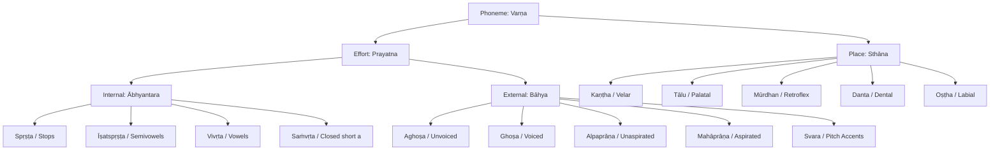

The Sanskrit computational engine in `vyutils` (`vyasa-phonetics`) is designed to model both **Vedic (Pre-Pāṇinian)** and **Classical (Pāṇinian)** linguistic structures with mathematical rigor.

Most contemporary Sanskrit NLP libraries treat Sanskrit as a single static alphabet, stripping Vedic accents and flattening historical phonological nuances. This document explains the underlying phonetic principles implemented in `vyasa-phonetics`.

---

## 1. Pre-Pāṇinian Phonetics: Śaunaka's Ṛgveda-Prātiśākhya

Before Pāṇini codified the grammar of classical Sanskrit in his *Aṣṭādhyāyī* (c. 5th–4th century BCE), ancient Vedic reciters (*śrotriyas*) preserved the oral tradition through **Prātiśākhyas**—treatises dedicated to the exact phonetics and text-transformation rules of specific Vedic *śākhās* (recensions).

The earliest and most prominent of these is the **Ṛgveda-Prātiśākhya (RPr.)**, attributed to Sage Śaunaka of the Śaiśirīya school.

### The Śaiśirīya Vowel Sequence

In modern Devanagari and Classical Sanskrit alphabets, vowels are arranged in the Pāṇinian or Pan-Indic order:

```text
a, ā, i, ī, u, ū, ṛ, ṝ, ḷ, e, ai, o, au
```

However, the Ṛgveda-Prātiśākhya establishes an alternative sequence known as the **Śaiśirīya sequence**:

```text
a, ṛ, i, u, e, o, ai, au
```

#### Acoustic Rationale: Vocal Tract Expansion

Why did Śaunaka position **ṛ** immediately after **a**, before **i** and **u**?

The sequence reflects an acoustic and articulatory progression from the rear of the vocal tract forward:
1. **a**: *Kaṇṭhya* (velar / glottal)—produced at the base of the throat with maximum open cavity.
2. **ṛ**: *Mūrdhanya* (retroflex)—produced at the hard palate roof, intermediate between throat and teeth.
3. **i**: *Tālavya* (palatal)—produced at the hard palate.
4. **u**: *Oṣṭhya* (labial)—produced at the outermost point of articulation (the lips).

In `vyasa-phonetics`, this sequence is modeled as `SAISIRIYA_VOWELS`.

### Samānākṣara vs Sandhyakṣara

The Prātiśākhya distinguishes two fundamental categories of vowels:

1. **Samānākṣara** ("homogeneous" or "simple" vowels):
   - Eight vowels: a, ā, ṛ, ṝ, i, ī, u, ū (and vocalic ḷ).
   - Formed by a uniform, single articulatory position.
2. **Sandhyakṣara** ("compound" vowels or diphthongs):
   - Four vowels: e, o, ai, au.
   - Formed by uniting two vowel qualities:
     - e = a + i
     - o = a + u
     - ai = ā + i
     - au = ā + u

### Nāmin Vowels and Retroflexion (Nati)

One of the most consequential phonetic categories in Vedic phonology is the **Nāmin** class (RPr. 1.65):

> **Definition**: All vowels **other than** a and ā are termed *Nāmin*.
>
> Nāmin = {i, ī, u, ū, ṛ, ṝ, ḷ, e, ai, o, au}

#### The Linguistic Role of Nāmin Vowels

In Vedic phonology, when a dental consonant (s or n) is preceded by a *Nāmin* vowel (even if separated by an Anusvāra), it undergoes **Nati** (automatic retroflexion):

- s ⟶ ṣ
- n ⟶ ṇ

For example:
- *agni* + *su* ⟶ *agniṣu* (because *i* is a Nāmin vowel).
- *vṛkṣa* + *su* ⟶ *vṛkṣeṣu* (because *e* is a Nāmin vowel).
- *rāma* + *su* ⟶ *rāmasu* (dental *s* remains because *a* is **not** a Nāmin vowel).

In classical grammar, Pāṇini generalized this under the famous **iṇ-koḥ** rule (*Aṣṭādhyāyī* 8.3.57), where the pratyāhāra *iṇ* designates the same set of non-a vowels plus semivowels.

`vyasa-phonetics` exposes `is_namin(vowel)` to evaluate this directly for Vedic text transformation.

---

## 2. Pāṇinian Phonology: The 14 Māheśvara Sūtras

In the 5th century BCE, Pāṇini formalized Sanskrit phonology in the introductory section of the *Aṣṭādhyāyī* via the **14 Māheśvara Sūtras** (Śiva Sūtras), traditionally said to have resonated from Lord Śiva's *ḍamaru* (drum):

| Sūtra No. | Sūtra Text | Sounds Encoded | It (Anubandha) Marker |
|:---:|:---|:---|:---:|
| 1 | **a-i-u-ṇ** | a, i, u | ṇ |
| 2 | **ṛ-ḷ-k** | ṛ, ḷ | k |
| 3 | **e-o-ṅ** | e, o | ṅ |
| 4 | **ai-au-c** | ai, au | c |
| 5 | **ha-ya-va-ra-ṭ** | h, y, v, r | ṭ |
| 6 | **la-ṇ** | l | ṇ |
| 7 | **ña-ma-ṅa-ṇa-na-m** | ñ, m, ṅ, ṇ, n (nasals) | m |
| 8 | **jha-bha-ñ** | jh, bh (voiced aspirated stops) | ñ |
| 9 | **gha-ḍha-dha-ṣ** | gh, ḍh, dh (voiced aspirated stops) | ṣ |
| 10 | **ja-ba-ga-ḍa-da-ś** | j, b, g, ḍ, d (voiced unaspirated stops) | ś |
| 11 | **kha-pha-cha-ṭha-tha-ca-ṭa-ta-v** | kh, ph, ch, ṭh, th, c, ṭ, t (unvoiced stops) | v |
| 12 | **ka-pa-y** | k, p (unvoiced velar & labial stops) | y |
| 13 | **śa-ṣa-sa-r** | ś, ṣ, s (sibilants) | r |
| 14 | **ha-l** | h | l |

### Pratyāhāra Formation: The Algebraic Condenser

Pāṇini defines the construction of phonetic abbreviations in rule 1.1.71:

> **ādir antyena sahetā** (1.1.71)
> *"An initial sound combined with a final marker (it) denotes itself, the intervening sounds, but not the markers."*

This allows any sound set to be described in two characters:

- **`ac`** (vowels): from initial sound `a` (Sūtra 1) to marker `c` (Sūtra 4) = `{a, i, u, ṛ, ḷ, e, o, ai, au}`.
- **`hal`** (consonants): from initial sound `h` (Sūtra 5) to marker `l` (Sūtra 14) = all 33 consonants.
- **`al`** (all phonemes): from `a` (Sūtra 1) to `l` (Sūtra 14) = all vowels and consonants.
- **`ik`**: from `i` (Sūtra 1) to marker `k` (Sūtra 2) = `{i, u, ṛ, ḷ}`. Crucial for *yaṇ-sandhi* (Pāṇini 6.1.77 *iko yaṇ aci*).
- **`yaṇ`**: `{y, v, r, l}` (semivowels).
- **`jaś`**: `{j, b, g, ḍ, d}` (unaspirated voiced stops).
- **`khar`**: `{kh, ph, ch, ṭh, th, c, ṭ, t, k, p, ś, ṣ, s}` (all unvoiced consonants).

In `vyasa-phonetics`, the `panini` module provides dynamic compile-time and runtime evaluation of all 42+ canonical Pratyāhāras via `evaluate_pratyahara("ik")`.

---

## 3. Śikṣā Articulatory Phonetics

*Śikṣā* (the Vedāṅga discipline of phonetics) classifies each sound according to two parameters: **Sthāna** (where in the vocal tract it is formed) and **Prayatna** (how the breath is manipulated).



### 1. Sthāna (Points of Articulation)

1. **Kaṇṭha (Throat / Velar)**: a, ā, k, kh, g, gh, ṅ, h, Visarga (ḥ).
2. **Tālu (Palate / Palatal)**: i, ī, c, ch, j, jh, ñ, y, ś.
3. **Mūrdhan (Roof / Retroflex)**: ṛ, ṝ, ṭ, ṭh, ḍ, ḍh, ṇ, r, ṣ, and Vedic ळ (LVedic).
4. **Danta (Teeth / Dental)**: ḷ, t, th, d, dh, n, l, s.
5. **Oṣṭha (Lips / Labial)**: u, ū, p, ph, b, bh, m, Upadhmānīya.
6. **Compound Places**:
   - **Kaṇṭha-Tālu**: e, ai.
   - **Kaṇṭha-Oṣṭha**: o, au.
   - **Danta-Oṣṭha**: v.
   - **Nāsikā (Nose)**: Anusvāra (ṁ) and all class nasals.

### 2. Ābhyantara Prayatna (Internal Effort)

Occurs inside the oral cavity before the air is released:
- **Spṛṣṭa** (Complete contact): Stops (k through m).
- **Īṣatspṛṣṭa** (Slight contact): Semivowels (y, r, l, v).
- **Vivṛta** (Open): Vowels (a, i, u...) and sibilants (ś, ṣ, s, h).
- **Saṁvṛta** (Closed): Short *a* in actual pronunciation (though treated as *Vivṛta* for grammatical derivation per Pāṇini 8.4.68 *a a*).

### 3. Bāhya Prayatna (External Effort)

Occurs at the larynx as the air is released:
- **Śvāsa, Aghoṣa, Alpaprāṇa**: Unvoiced, unaspirated stops (k, c, ṭ, t, p).
- **Śvāsa, Aghoṣa, Mahāprāṇa**: Unvoiced, aspirated stops (kh, ch, ṭh, th, ph).
- **Nāda, Ghoṣa, Alpaprāṇa**: Voiced, unaspirated stops (g, j, ḍ, d, b) and semivowels.
- **Nāda, Ghoṣa, Mahāprāṇa**: Voiced, aspirated stops (gh, jh, ḍh, dh, bh) and h.
- **Pitch Accents (Svara)**:
  - **Udātta** (High tone, acute): *uccair udāttaḥ* (Pāṇini 1.2.29).
  - **Anudātta** (Low tone, grave): *nīcair anudāttaḥ* (Pāṇini 1.2.30).
  - **Svarita** (Falling circumflex): *samāhāraḥ svaritaḥ* (Pāṇini 1.2.31).

---

## 4. Vedic Sound Inventory

`vyasa-phonetics` explicitly models phonetic entities unique to the Vedic Saṁhitās:

### 1. The Vedic Flaps: ळ (LVedic) and ळ्ह (LhVedic)

In the Ṛgveda (Śākala recension), when a retroflex stop ḍ or ḍh occurs **intervocalically** (between two vowels), it is systematically pronounced as a lateral retroflex flap:

- ḍ ⟶ ळ (LVedic, U+0933)
- ḍh ⟶ ळ्ह (LhVedic, U+0934)

**Canonical Example: Ṛgveda 1.1.1**
```text
अग्निमीडे ⟶ अ॒ग्निमी॑ळे पु॒रोहि॑तम्
```

Notice:
- *īḍe* (from root *īḍ*, "to praise") becomes *īḷe*.
- In `vyasa-phonetics`, this is represented as `Consonant::LVedic`.
- In Roman transliteration:
  - ISO 15919: `l̤`
  - IAST: `ḷ` (requiring contextual disambiguation from vocalic `l̥` / `ऌ`).

### 2. Vedic Ayogavāhas

*Ayogavāha* refers to sounds that cannot occur independently and must be carried by a preceding vowel:
- **Jihvāmūlīya** (≍ k): Velar spirant [x] occurring before k and kh.
- **Upadhmānīya** (≍ p): Bilabial spirant [ɸ] occurring before p and ph.
- **Gomukha & Dvibindu**: Specialized Vedic nasal variants occurring before sibilants and semivowels.
- **Ardhavisarga**: The half-visarga sign (`U+1CF2`).

---

## Next Steps

- Explore how `vyasa-lipi` uses this phonetic model for multi-script transliteration: **[Vedic Transliteration Explanation](file:///Users/anand/Projects/project-vyasa/vyutils/documentation-site/src/content/docs/explanation/vedic-transliteration.md)**
- Review the crate API: **[vyasa-phonetics Reference](file:///Users/anand/Projects/project-vyasa/vyutils/documentation-site/src/content/docs/reference/vyasa-phonetics.md)**
