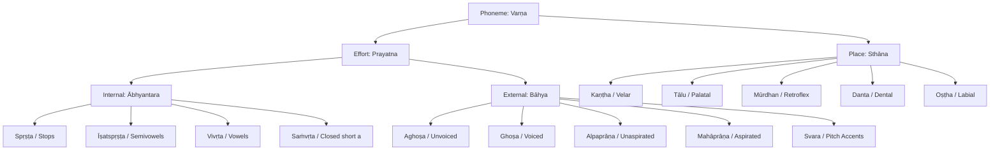

The Sanskrit computational engine in `vyutils` (`vyasa-phonetics`) is designed to model both **Vedic (Pre-Pāṇinian)** and **Classical (Pāṇinian)** linguistic structures with mathematical rigor.

Most contemporary Sanskrit NLP libraries treat Sanskrit as a single static alphabet, stripping Vedic accents and flattening historical phonological nuances. This document explains the underlying phonetic principles implemented in `vyasa-phonetics`.

---

## 1. Pre-Pāṇinian Phonetics: Śaunaka's Ṛgveda-Prātiśākhya

Before Pāṇini codified the grammar of classical Sanskrit in his *Aṣṭādhyāyī* (c. 5th–4th century BCE), ancient Vedic reciters (*śrotriyas*) preserved the oral tradition through **Prātiśākhyas**—treatises dedicated to the exact phonetics and text-transformation rules of specific Vedic *śākhās* (recensions).

The earliest and most prominent of these is the **Ṛgveda-Prātiśākhya (RPr.)**, attributed to Sage Śaunaka of the Śaiśirīya school.

### The Śaiśirīya Vowel Sequence

In modern Devanagari and Classical Sanskrit alphabets, vowels are arranged in the Pāṇinian or Pan-Indic order:

```text
a, ā, i, ī, u, ū, ṛ, ṝ, ḷ, e, ai, o, au
```

However, the Ṛgveda-Prātiśākhya establishes an alternative sequence known as the **Śaiśirīya sequence**:

```text
a, ṛ, i, u, e, o, ai, au
```

#### Acoustic Rationale: Vocal Tract Expansion

Why did Śaunaka position **ṛ** immediately after **a**, before **i** and **u**?

The sequence reflects an acoustic and articulatory progression from the rear of the vocal tract forward:
1. **a**: *Kaṇṭhya* (velar / glottal)—produced at the base of the throat with maximum open cavity.
2. **ṛ**: *Mūrdhanya* (retroflex)—produced at the hard palate roof, intermediate between throat and teeth.
3. **i**: *Tālavya* (palatal)—produced at the hard palate.
4. **u**: *Oṣṭhya* (labial)—produced at the outermost point of articulation (the lips).

In `vyasa-phonetics`, this sequence is modeled as `SAISIRIYA_VOWELS`.

### Samānākṣara vs Sandhyakṣara

The Prātiśākhya distinguishes two fundamental categories of vowels:

1. **Samānākṣara** ("homogeneous" or "simple" vowels):
   - Eight vowels: a, ā, ṛ, ṝ, i, ī, u, ū (and vocalic ḷ).
   - Formed by a uniform, single articulatory position.
2. **Sandhyakṣara** ("compound" vowels or diphthongs):
   - Four vowels: e, o, ai, au.
   - Formed by uniting two vowel qualities:
     - e = a + i
     - o = a + u
     - ai = ā + i
     - au = ā + u

### Nāmin Vowels and Retroflexion (Nati)

One of the most consequential phonetic categories in Vedic phonology is the **Nāmin** class (RPr. 1.65):

> **Definition**: All vowels **other than** a and ā are termed *Nāmin*.
>
> Nāmin = {i, ī, u, ū, ṛ, ṝ, ḷ, e, ai, o, au}

#### The Linguistic Role of Nāmin Vowels

In Vedic phonology, when a dental consonant (s or n) is preceded by a *Nāmin* vowel (even if separated by an Anusvāra), it undergoes **Nati** (automatic retroflexion):

- s ⟶ ṣ
- n ⟶ ṇ

For example:
- *agni* + *su* ⟶ *agniṣu* (because *i* is a Nāmin vowel).
- *vṛkṣa* + *su* ⟶ *vṛkṣeṣu* (because *e* is a Nāmin vowel).
- *rāma* + *su* ⟶ *rāmasu* (dental *s* remains because *a* is **not** a Nāmin vowel).

In classical grammar, Pāṇini generalized this under the famous **iṇ-koḥ** rule (*Aṣṭādhyāyī* 8.3.57), where the pratyāhāra *iṇ* designates the same set of non-a vowels plus semivowels.

`vyasa-phonetics` exposes `is_namin(vowel)` to evaluate this directly for Vedic text transformation.

---

## 2. Pāṇinian Phonology: The 14 Māheśvara Sūtras

In the 5th century BCE, Pāṇini formalized Sanskrit phonology in the introductory section of the *Aṣṭādhyāyī* via the **14 Māheśvara Sūtras** (Śiva Sūtras), traditionally said to have resonated from Lord Śiva's *ḍamaru* (drum):

| Sūtra No. | Sūtra Text | Sounds Encoded | It (Anubandha) Marker |
|:---:|:---|:---|:---:|
| 1 | **a-i-u-ṇ** | a, i, u | ṇ |
| 2 | **ṛ-ḷ-k** | ṛ, ḷ | k |
| 3 | **e-o-ṅ** | e, o | ṅ |
| 4 | **ai-au-c** | ai, au | c |
| 5 | **ha-ya-va-ra-ṭ** | h, y, v, r | ṭ |
| 6 | **la-ṇ** | l | ṇ |
| 7 | **ña-ma-ṅa-ṇa-na-m** | ñ, m, ṅ, ṇ, n (nasals) | m |
| 8 | **jha-bha-ñ** | jh, bh (voiced aspirated stops) | ñ |
| 9 | **gha-ḍha-dha-ṣ** | gh, ḍh, dh (voiced aspirated stops) | ṣ |
| 10 | **ja-ba-ga-ḍa-da-ś** | j, b, g, ḍ, d (voiced unaspirated stops) | ś |
| 11 | **kha-pha-cha-ṭha-tha-ca-ṭa-ta-v** | kh, ph, ch, ṭh, th, c, ṭ, t (unvoiced stops) | v |
| 12 | **ka-pa-y** | k, p (unvoiced velar & labial stops) | y |
| 13 | **śa-ṣa-sa-r** | ś, ṣ, s (sibilants) | r |
| 14 | **ha-l** | h | l |

### Pratyāhāra Formation: The Algebraic Condenser

Pāṇini defines the construction of phonetic abbreviations in rule 1.1.71:

> **ādir antyena sahetā** (1.1.71)  
> *"An initial sound combined with a final marker (it) denotes itself, the intervening sounds, but not the markers."*

This allows any sound set to be described in two characters:

- **`ac`** (vowels): from initial sound `a` (Sūtra 1) to marker `c` (Sūtra 4) = `{a, i, u, ṛ, ḷ, e, o, ai, au}`.
- **`hal`** (consonants): from initial sound `h` (Sūtra 5) to marker `l` (Sūtra 14) = all 33 consonants.
- **`al`** (all phonemes): from `a` (Sūtra 1) to `l` (Sūtra 14) = all vowels and consonants.
- **`ik`**: from `i` (Sūtra 1) to marker `k` (Sūtra 2) = `{i, u, ṛ, ḷ}`. Crucial for *yaṇ-sandhi* (Pāṇini 6.1.77 *iko yaṇ aci*).
- **`yaṇ`**: `{y, v, r, l}` (semivowels).
- **`jaś`**: `{j, b, g, ḍ, d}` (unaspirated voiced stops).
- **`jhas`**: `{jh, bh, gh, ḍh, dh}` (voiced aspirated stops).
- **`khar`**: `{kh, ph, ch, ṭh, th, c, ṭ, t, k, p, ś, ṣ, s}` (all unvoiced consonants).

In `vyasa-phonetics`, the `panini` module provides zero-allocation static arrays and dynamic evaluation of all canonical Pratyāhāras via `Pratyahara::from_name("ik")`.

*(For the complete mathematical mechanics, sonority hierarchy, the double-h rationale, and the 42-pratyāhāra master table, see the [Appendix](#appendix-deep-pāṇinian-phonological-architecture--implementation-mechanics) below).*

---

## 3. Śikṣā Articulatory Phonetics

*Śikṣā* (the Vedāṅga discipline of phonetics) classifies each sound according to two parameters: **Sthāna** (where in the vocal tract it is formed) and **Prayatna** (how the breath is manipulated).



### 1. Sthāna (Points of Articulation)

1. **Kaṇṭha (Throat / Velar)**: a, ā, k, kh, g, gh, ṅ, h, Visarga (ḥ).
2. **Tālu (Palate / Palatal)**: i, ī, c, ch, j, jh, ñ, y, ś.
3. **Mūrdhan (Roof / Retroflex)**: ṛ, ṝ, ṭ, ṭh, ḍ, ḍh, ṇ, r, ṣ, and Vedic ळ (LVedic).
4. **Danta (Teeth / Dental)**: ḷ, t, th, d, dh, n, l, s.
5. **Oṣṭha (Lips / Labial)**: u, ū, p, ph, b, bh, m, Upadhmānīya.
6. **Compound Places**:
   - **Kaṇṭha-Tālu**: e, ai.
   - **Kaṇṭha-Oṣṭha**: o, au.
   - **Danta-Oṣṭha**: v.
   - **Nāsikā (Nose)**: Anusvāra (ṁ) and all class nasals.

### 2. Ābhyantara Prayatna (Internal Effort)

Occurs inside the oral cavity before the air is released:
- **Spṛṣṭa** (Complete contact): Stops (k through m).
- **Īṣatspṛṣṭa** (Slight contact): Semivowels (y, r, l, v).
- **Vivṛta** (Open): Vowels (a, i, u...) and sibilants (ś, ṣ, s, h).
- **Saṁvṛta** (Closed): Short *a* in actual pronunciation (though treated as *Vivṛta* for grammatical derivation per Pāṇini 8.4.68 *a a*).

### 3. Bāhya Prayatna (External Effort)

Occurs at the larynx as the air is released:
- **Śvāsa, Aghoṣa, Alpaprāṇa**: Unvoiced, unaspirated stops (k, c, ṭ, t, p).
- **Śvāsa, Aghoṣa, Mahāprāṇa**: Unvoiced, aspirated stops (kh, ch, ṭh, th, ph).
- **Nāda, Ghoṣa, Alpaprāṇa**: Voiced, unaspirated stops (g, j, ḍ, d, b) and semivowels.
- **Nāda, Ghoṣa, Mahāprāṇa**: Voiced, aspirated stops (gh, jh, ḍh, dh, bh) and h.
- **Pitch Accents (Svara)**:
  - **Udātta** (High tone, acute): *uccair udāttaḥ* (Pāṇini 1.2.29).
  - **Anudātta** (Low tone, grave): *nīcair anudāttaḥ* (Pāṇini 1.2.30).
  - **Svarita** (Falling circumflex): *samāhāraḥ svaritaḥ* (Pāṇini 1.2.31).

---

## 4. Vedic Sound Inventory

`vyasa-phonetics` explicitly models phonetic entities unique to the Vedic Saṁhitās:

### 1. The Vedic Flaps: ळ (LVedic) and ळ्ह (LhVedic)

In the Ṛgveda (Śākala recension), when a retroflex stop ḍ or ḍh occurs **intervocalically** (between two vowels), it is systematically pronounced as a lateral retroflex flap:

- ḍ ⟶ ळ (LVedic, U+0933)
- ḍh ⟶ ळ्ह (LhVedic, U+0934)

**Canonical Example: Ṛgveda 1.1.1**
```text
अग्निमीडे ⟶ अ॒ग्निमी॑ळे पु॒रोहि॑तम्
```

Notice:
- *īḍe* (from root *īḍ*, "to praise") becomes *īḷe*.
- In `vyasa-phonetics`, this is represented as `Consonant::LVedic`.
- In Roman transliteration:
  - ISO 15919: `l̤`
  - IAST: `ḷ` (requiring contextual disambiguation from vocalic `l̥` / `ऌ`).

### 2. Vedic Ayogavāhas

*Ayogavāha* refers to sounds that cannot occur independently and must be carried by a preceding vowel:
- **Jihvāmūlīya** (≍ k): Velar spirant [x] occurring before k and kh.
- **Upadhmānīya** (≍ p): Bilabial spirant [ɸ] occurring before p and ph.
- **Gomukha & Dvibindu**: Specialized Vedic nasal variants occurring before sibilants and semivowels.
- **Ardhavisarga**: The half-visarga sign (`U+1CF2`).

---

## Appendix: Deep Pāṇinian Phonological Architecture & Implementation Mechanics

During the engineering of `crates/vyasa-phonetics/src/panini.rs`, we implemented several profound linguistic conventions established by Pāṇini and elucidated by Patañjali (*Mahābhāṣya*) and Bhaṭṭoji Dīkṣita (*Siddhānta Kaumudī*). These architectural decisions solve subtle edge cases in computational Sanskrit.

---

### Appendix A: The Sonority Hierarchy & Acoustic Ordering Logic

Why are the 14 Śiva Sūtras ordered the way they are? The sequence is not arbitrary; it is an impeccably designed **descending acoustic sonority hierarchy**:

```
[Sūtras 1–4: Vowels (Svara)]  ──▶  Most Sonorous
      │  1–2: Simple vowels (Monophthongs: a, i, u, ṛ, ḷ)
      │  3–4: Complex vowels (Diphthongs: e, o, ai, au)
      ▼
[Sūtras 5–6: Semivowels (Antaḥstha)]
      │  h, y, v, r, l
      ▼
[Sūtra 7: Nasals (Anunāsika)]  ──▶  Class 5 Stops (ñ, m, ṅ, ṇ, n)
      ▼
[Sūtras 8–9: Voiced Aspirated Stops]  ──▶  Class 4 Stops (jh, bh, gh, ḍh, dh)
      ▼
[Sūtra 10: Voiced Unaspirated Stops]  ──▶  Class 3 Stops (j, b, g, ḍ, d)
      ▼
[Sūtra 11a: Unvoiced Aspirated Stops]  ──▶  Class 2 Stops (kh, ph, ch, ṭh, th)
      ▼
[Sūtra 11b–12: Unvoiced Unaspirated Stops]  ──▶  Class 1 Stops (c, ṭ, t, k, p)
      ▼
[Sūtras 13–14: Sibilants & Aspirate (Ūṣman)]  ──▶  Fricatives (ś, ṣ, s, h)
```

#### Why This Ordering Matters Computationally
By ordering the phonemes in this reverse-sonority cascade, Pāṇini ensured that every major phonological natural class can be sliced as a **single continuous contiguous subarray** with a single two-character Pratyāhāra:
- **All voiced consonants**: `haś` (Sūtra 5 to 10) = Semivowels + Class 5 + Class 4 + Class 3.
- **All stops**: `ñay` (Sūtra 7 to 12) = Class 5 + 4 + 3 + 2 + 1.
- **All unvoiced consonants**: `khar` (Sūtra 11 to 13) = Class 2 + Class 1 + Sibilants.
- **All non-nasal, non-semivowel consonants**: `jhal` (Sūtra 8 to 14) = Classes 4 + 3 + 2 + 1 + Fricatives.

In `vyasa-phonetics`, this property allows us to store canonical static slices with zero heap allocations.

---

### Appendix B: The Dual 'ha' Rationale (*Dvir-vacanaṃ Hakārasya*)

A famous question in Sanskrit grammar is: **Why did Pāṇini utter `h` twice**—first in Sūtra 5 (*ha-ya-va-ra-ṭ*) and again in Sūtra 14 (*ha-l*)?

In the *Mahābhāṣya*, Patañjali addresses this directly:
1. **The Need for `h` in Sūtra 5**:
   - **Pratyāhāra `aṭ`** (Sūtras 1–5 = vowels + semivowels + h): In rule 8.4.2 (*aṭ-kupv-āṅ-num-vyavāye'pi*), dental *n* becomes retroflex *ṇ* even when intervened by sounds of `aṭ`. If `h` were not in Sūtra 5, words like *hariṇā* or *rohiṇī* would fail to undergo *nati*!
   - **Pratyāhāra `haś`** (Sūtras 5–10 = voiced consonants): In rule 6.1.114 (*haśi ca*), Visarga preceded by short *a* becomes *u* before a voiced consonant (e.g. *śivaḥ* + *vandyah* ⟶ *śivo vandyaḥ*; *śivaḥ* + *hasati* ⟶ *śivo hasati*). If `h` were not in Sūtra 5, *śivo hasati* would be ungrammatical!
2. **The Need for `h` in Sūtra 14**:
   - **Pratyāhāra `śal`** (Sūtras 13–14 = ś, ṣ, s, h): In rule 3.1.45 (*śala igupadhād anitaḥ ksaḥ*), the aorist affix *ksa* applies after roots ending in `śal` (including *duh* ⟶ *adhukṣat*).
   - **Pratyāhāra `jhal`** (Sūtras 8–14 = all stops and fricatives): In rule 8.2.39 (*jhalaṃ jaśo'nte*), terminal stops and aspirates undergo voicing assimilation to class 3 (e.g. *līh* ⟶ *līḍ*).

Thus, `h` is uttered twice to satisfy independent phonological grouping constraints without violating the contiguous subarray principle.

---

### Appendix C: The Dual 'ṇa' Marker Disambiguation (*Pūrveṇa Pareṇa Vā*)

The 14 Sūtras contain another intentional ambiguity: **the *it*-marker `ṇa` appears twice**:
- Sūtra 1: *a-i-u-**ṇ**
- Sūtra 6: *la-**ṇ**

When Pāṇini writes a rule mentioning the Pratyāhāra **`aṇ`** or **`iṇ`**, which `ṇ` is intended?

#### The Pāṇinian Hermeneutic Rule
The ancient commentators established the canonical resolution rule:
> **aṇ-grahaṇeṣu pūrveṇa, iṇ-grahaṇe pareṇa**  
> *"In pratyāhāras starting with 'a', the first ṇa is intended (except in one rule). In pratyāhāras starting with 'i', the second ṇa is intended."*

Specifically:
1. **Pratyāhāra `aṇ` with the First `ṇ` (Sūtra 1)**:
   - Contains `{a, i, u}` (3 sounds).
   - Used in Pāṇini 1.1.69: *aṇudit savarṇasya cāpratyayaḥ*. Here, *aṇ* represents only *a, i, u*.
2. **Pratyāhāra `aṇ` with the Second `ṇ` (Sūtra 6)**:
   - Contains `{a, i, u, ṛ, ḷ, e, o, ai, au, h, y, v, r, l}` (14 sounds).
   - Used in Pāṇini 8.4.57: *aṇo'pragṛhyasyānunāsikaḥ* (nasalization of sentence-final non-pragṛhya vowels and semivowels).
3. **Pratyāhāra `iṇ` with the Second `ṇ` (Sūtra 6)**:
   - Contains `{i, u, ṛ, ḷ, e, o, ai, au, h, y, v, r, l}` (13 sounds).
   - Used in the famous retroflexion rule Pāṇini 8.3.57: *iṇ-koḥ* (*iṇ* sounds and velar stops cause following dental *s* to become *ṣ*).

In `crates/vyasa-phonetics/src/panini.rs`, this is codified through distinct enum variants `ItMarker::Nn1` and `ItMarker::Nn2`.

---

### Appendix D: The Nasalized Vowel Marker and the 'ra' Pratyāhāra

How does Pāṇini refer to the pair of liquids `{r, l}`?

In rule 1.3.2:
> **upadeśe'janunāsika it** (1.3.2)  
> *"In the foundational metalanguage (upadeśa), a nasalized vowel is an it-marker."*

In Sūtra 6 (*la-ṇ*), the vowel *a* following *l* is traditionally pronounced **nasalized** (*la~*). Therefore, the *a* in *la* is itself an *it*-marker!

By applying rule 1.1.71 (*ādir antyena sahetā*):
- The initial sound `r` from Sūtra 5 (*ha-ya-va-**ra**-ṭ*)
- Combined with the *it*-marker `a~` from Sūtra 6 (*l-**a~**-ṇ*)
- Yields the unique two-sound Pratyāhāra **`ra`** = `{r, l}`!

This Pratyāhāra is required for rule 1.1.51:
> **uraṇ raparaḥ** (1.1.51)  
> *"When a replacement (guṇa or vṛddhi) takes the place of vocalic ṛ, it is followed by r or l."*  
> (e.g. *kṛ* + *ta* ⟶ *k**ar**ta*; *kḷp* ⟶ *k**al**pate*).

---

### Appendix E: Homogeneity and Representation (*Savarṇa* & *Aṇudit*)

In Pāṇinian grammar, a single letter in a rule does not merely represent a single phonetic realization. It represents an entire family of homogeneous sounds:

> **tulyāsya-prayatnaṃ savarṇam** (1.1.9)  
> *"Sounds that share identical place of articulation (āsya / sthāna) and internal effort (ābhyantara prayatna) are mutually homogeneous (savarṇa)."*

> **aṇudit savarṇasya cāpratyayaḥ** (1.1.69)  
> *"Sounds of the aṇ pratyāhāra, and consonants marked with 'u' (udit), represent all their homogeneous varieties."*

#### The 18 Varieties of Vowels
A single written **`a`** represents $3 \times 3 \times 2 = 18$ distinct varieties:
- **3 lengths**: *Hrasva* (1 mātrā), *Dīrgha* (2 mātrās), *Pluta* (3 mātrās)
- **3 pitch accents**: *Udātta* (high), *Anudātta* (low), *Svarita* (circumflex)
- **2 nasalization states**: *Anunāsika* (nasalized), *Ananunāsika* (un-nasalized)

#### Special Cases
- **`e, o, ai, au`** (Sandhyakṣara): Lack short (*hrasva*) forms, representing $2 \times 3 \times 2 = 12$ varieties each.
- **`ḷ`**: Lacks long (*dīrgha*) form in standard usage, representing $2 \times 3 \times 2 = 12$ varieties.
- **`ṛ` and `ḷ` Homogeneity**: Kātyāyana's famous Vārttika (*ṛkāra-ḷkārayoḥ mithas sāvarṇyaṃ vācyam*) declares that `ṛ` (mūrdhanya) and `ḷ` (dantya) are mutually homogeneous, allowing their union to represent $18 + 12 = 30$ varieties!

---

### Appendix F: The *Udit* Consonant Class Shorthand (*Ku, Cu, Ṭu, Tu, Pu*)

In addition to Pratyāhāras, Pāṇini employs the suffix **`-u`** (*udit*) to denote the five Sparśa consonant vargas:

| Udit Form | Class Name | Consonants Denoted | Articulatory Place |
|:---:|:---|:---|:---|
| **ku** | Ka-varga | k, kh, g, gh, ṅ | Kaṇṭha (Velar) |
| **cu** | Ca-varga | c, ch, j, jh, ñ | Tālu (Palatal) |
| **ṭu** | Ṭa-varga | ṭ, ṭh, ḍ, ḍh, ṇ | Mūrdhan (Retroflex) |
| **tu** | Ta-varga | t, th, d, dh, n | Danta (Dental) |
| **pu** | Pa-varga | p, ph, b, bh, m | Oṣṭha (Labial) |

This enables elegant compound rules such as:
- **ṣṭunā ṣṭuḥ** (8.4.41): Retroflex assimilation (dental *tu* becomes retroflex *ṭu* before *ṣṭu*).
- **stoḥ ścunā ścuḥ** (8.4.40): Palatal assimilation (dental *tu* becomes palatal *cu* before *ścu*).

---

### Appendix G: Master Catalog of Canonical Pāṇinian Pratyāhāras

Below is the complete structural catalog of canonical Pratyāhāras used across the *Aṣṭādhyāyī*, codified in `vyasa-phonetics::panini`:

| Pratyāhāra | Bounds (Start $\to$ It) | Count | Sounds Included | Primary Pāṇinian Application |
|:---|:---|:---:|:---|:---|
| **`aṇ` (1)** | a $\to$ ṇ (1) | 3 | a, i, u | 1.1.69 Representation rule (*aṇudit savarṇasya*) |
| **`ak`** | a $\to$ k (2) | 5 | a, i, u, ṛ, ḷ | 6.1.101 Homogeneous long vowel sandhi (*akaḥ savarṇe dīrghaḥ*) |
| **`ik`** | i $\to$ k (2) | 4 | i, u, ṛ, ḷ | 6.1.77 Semivowel substitution (*iko yaṇ aci*) |
| **`uk`** | u $\to$ k (2) | 3 | u, ṛ, ḷ | 1.2.11 Morphological ablaut |
| **`ec`** | e $\to$ c (4) | 4 | e, o, ai, au | 6.1.78 Diphthong sandhi (*eco'yavāyāvaḥ*) |
| **`aic`** | ai $\to$ c (4) | 2 | ai, au | 1.1.1 Vṛddhi definition (*vṛddhir ādaic*) |
| **`ac`** | a $\to$ c (4) | 9 | a, i, u, ṛ, ḷ, e, o, ai, au | Complete set of Sanskrit vowels |
| **`aṭ`** | a $\to$ ṭ (5) | 13 | Vowels + h, y, v, r | 8.4.2 N-retroflexion intervener (*aṭ-kupv-āṅ-num*) |
| **`aṇ` (2)** | a $\to$ ṇ (6) | 14 | Vowels + h, y, v, r, l | 8.4.57 Final nasalization (*aṇo'pragṛhyasya*) |
| **`iṇ`** | i $\to$ ṇ (6) | 13 | i, u, ṛ, ḷ, e, o, ai, au, h, y, v, r, l | 8.3.57 S-retroflexion trigger (*iṇ-koḥ*) |
| **`yaṇ`** | y $\to$ ṇ (6) | 4 | y, v, r, l | 6.1.77 Semivowels (*iko yaṇ aci*) |
| **`ñam`** | ñ $\to$ m (7) | 5 | ñ, m, ṅ, ṇ, n | 8.3.32 Nasal doubling (*ṅamo hrasvād aci*) |
| **`ṅam`** | ṅ $\to$ m (7) | 3 | ṅ, ṇ, n | 8.3.32 Terminal nasal gemination |
| **`jhas`** | jh $\to$ ṣ (9) | 5 | jh, bh, gh, ḍh, dh | Class 4 voiced aspirates |
| **`bhaṣ`** | bh $\to$ ṣ (9) | 4 | bh, gh, ḍh, dh | Grassman's Law / de-aspiration trigger |
| **`jhas`** | jh $\to$ ś (10) | 10 | Class 4 + Class 3 stops | 8.4.53 Assimilation conditioning (*jhalaṃ jaś jhasi*) |
| **`jaś`** | j $\to$ ś (10) | 5 | j, b, g, ḍ, d | 8.2.39 Terminal voicing assimilation (*jhalaṃ jaśo'nte*) |
| **`baś`** | b $\to$ ś (10) | 4 | b, g, ḍ, d | Bartholomae's Law conditions |
| **`chav`** | ch $\to$ v (11) | 3 | ch, ṭh, th | Unvoiced aspirates before sibilants |
| **`khay`** | kh $\to$ y (12) | 10 | Classes 2 + 1 (all unvoiced stops) | Unvoiced stop conditioning |
| **`cay`** | c $\to$ y (12) | 5 | c, ṭ, t, k, p | Class 1 unvoiced unaspirated stops |
| **`yay`** | y $\to$ y (12) | 19 | Semivowels + nasals + stops | 8.4.58 Parasavarṇa nasal assimilation |
| **`may`** | m $\to$ y (12) | 18 | Nasals + stops | 8.4.59 Optional nasal assimilation |
| **`jhoy`** | jh $\to$ y (12) | 14 | All stops (Classes 4, 3, 2, 1) | 8.4.62 Aspirate elision conditioning |
| **`khar`** | kh $\to$ r (13) | 13 | Classes 2 + 1 + ś, ṣ, s | 8.4.55 Terminal devoicing (*khari ca*) |
| **`car`** | c $\to$ r (13) | 8 | Class 1 stops + ś, ṣ, s | 8.4.54 Final devoicing output (*abhyāse carca*) |
| **`śar`** | ś $\to$ r (13) | 3 | ś, ṣ, s | Sibilants; Visarga assimilation trigger |
| **`śal`** | ś $\to$ l (14) | 4 | ś, ṣ, s, h | Fricatives / Ūṣman |
| **`jhal`** | jh $\to$ l (14) | 24 | Stops + Fricatives (Classes 4, 3, 2, 1, sibilants, h) | 8.2.39 Broad consonant assimilation domain |
| **`hal`** | h $\to$ l (14) | 34 | All 33 consonants (+ duplicated h) | Complete inventory of consonants |
| **`al`** | a $\to$ l (14) | 43 | All 9 vowels + 34 consonants | Complete Sanskrit phonetic universe |

---

## Next Steps

- Explore how `vyasa-lipi` uses this phonetic model for multi-script transliteration: **[Vedic Transliteration Explanation](file:///Users/anand/Projects/project-vyasa/vyutils/documentation-site/src/content/docs/explanation/vedic-transliteration.md)**
- Consult the developer integration guide: **[Sanskrit Developer Guide (Rust & WASM)](file:///Users/anand/Projects/project-vyasa/vyutils/documentation-site/src/content/docs/guides/sanskrit-developer-guide.md)**
- Review the crate API: **[vyasa-phonetics Reference](file:///Users/anand/Projects/project-vyasa/vyutils/documentation-site/src/content/docs/reference/vyasa-phonetics.md)**
