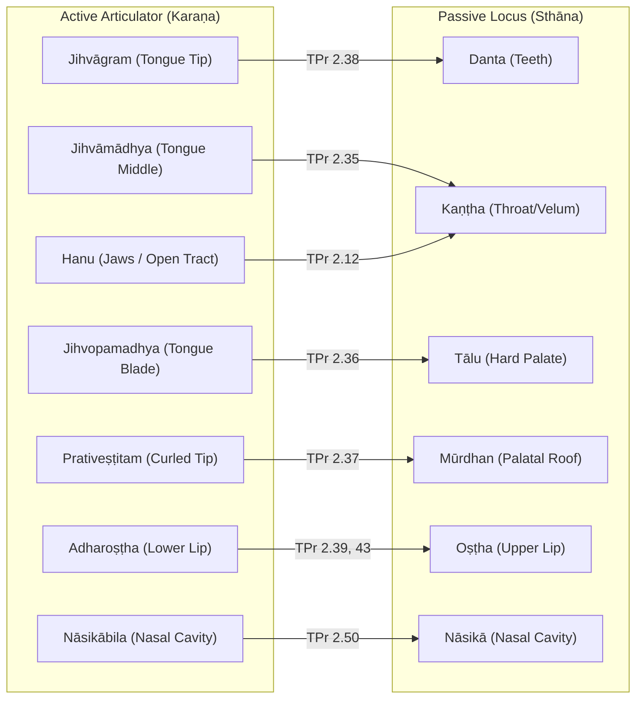
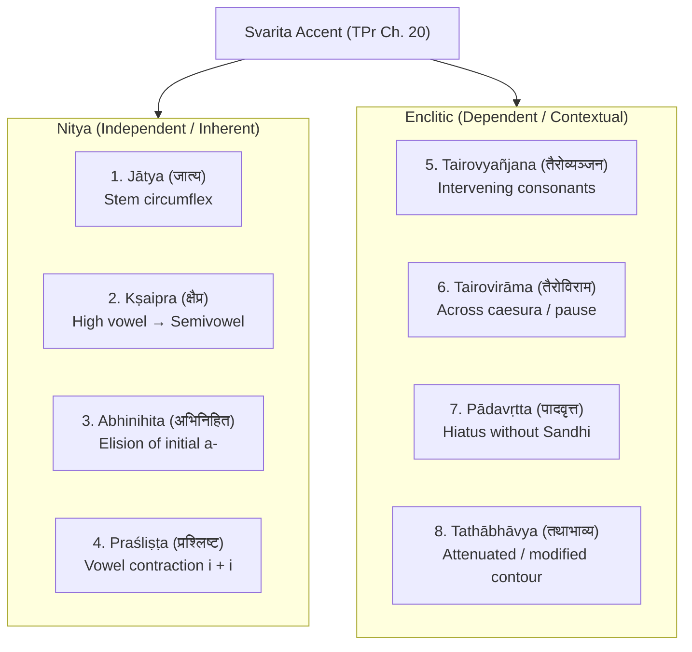

The **Krishna Yajurveda** (*Kṛṣṇa Yajurveda*, KYV)—predominantly preserved in the living tradition of the **Taittirīya Śākhā**—possesses one of the most sophisticated and mathematically precise phonetic systems in ancient linguistics. While classical Sanskrit grammar (*Aṣṭādhyāyī*) and Rigvedic phonology (*Ṛgveda-Prātiśākhya*) establish broad phonological frameworks, the ***Taittirīya-Prātiśākhya*** (**TPr**) articulates distinct phonetic requirements essential for authentic recitation of texts such as the *Taittirīya Saṃhitā*, *Taittirīya Brāhmaṇa*, *Taittirīya Āraṇyaka*, and the *Taittirīya Upaniṣad*.

Project Vyasa implements complete, native computational support for Taittirīya phonology within `vyasa-phonetics` and exposes high-level APIs via `@project-vyasa/sanskrit-wasm`.

---

## 1. The Dual Articulatory Model: Karaṇa vs. Sthāna

Classical Pāṇinian phonetics primarily categorizes speech sounds by their passive place of articulation (*Sthāna*). In contrast, the *Taittirīya-Prātiśākhya* (TPr Chapter 2) emphasizes a strict dual coordinate system:
1. **Sthāna (Passive Locus)**: The static part of the vocal tract (upper teeth, hard palate, velum).
2. **Karaṇa (Active Articulator)**: The dynamic, mobile organ (different zones of the tongue, lower lip, or jaw) that moves toward the locus to produce sound.



### Articulatory Mapping Table

| Sound Class | Varṇas | Sthāna (Passive Locus) | Karaṇa (Active Articulator) | TPr Sūtra |
|:---|:---|:---|:---|:---|
| **Velars (*Kaṇṭhya*)** | *k, kh, g, gh, ṅ* | Kaṇṭha (Throat/Velum) | **Jihvāmādhya** (Tongue dorsum/middle) | 2.35 |
| **Palatals (*Tālavya*)** | *c, ch, j, jh, ñ, y, ś* | Tālu (Hard palate) | **Jihvopamadhya** (Tongue blade/edges) | 2.36 |
| **Retroflexes (*Mūrdhanya*)** | *ṭ, ṭh, ḍ, ḍh, ṇ, r, ṣ, ḷ* | Mūrdhan (Roof of palate) | **Prativeṣṭitam** (Curled tongue tip) | 2.37 |
| **Dentals (*Dantya*)** | *t, th, d, dh, n, l, s* | Danta (Teeth roots) | **Jihvāgram** (Tip of tongue) | 2.38 |
| **Bilabials (*Oṣṭhya*)** | *p, ph, b, bh, m* | Oṣṭha (Upper lip) | **Adharoṣṭha** (Lower lip) | 2.39 |
| **Dentolabial** | *v* | Danta + Oṣṭha | **Adharoṣṭha** (Lower lip to teeth) | 2.43 |
| **Jihvāmūlīya** | *ẖ* (before *k, kh*) | Hanu-mūla (Velum base) | **Jihvāmūla** (Tongue root) | 2.44 |
| **Upadhmānīya** | *ḫ* (before *p, ph*) | Oṣṭha | **Adharoṣṭha** | 2.45 |
| **Vowels (*Svara*)** | *a, i, u, ṛ, ḷ, e, o...* | Respective loci | **Hanu** (Jaws/open vocal tract) | 2.12 |
| **Pure Nasals** | *Nāsikya*, *Anusvāra* | Nāsikā | **Nāsikābila** (Nasal cavity aperture) | 2.50 |

---

## 2. The 8-Fold Svarita Taxonomy (TPr Chapter 20)

In Vedic chant, the **Svarita** (circumflex pitch accent) is fundamentally categorized into two groups:
1. **Nitya (Independent / Inherent)**: Built into the word's underlying lexical stem or generated by morphological Sandhi independent of adjacent accents.
2. **Enclitic (Dependent / Contextual)**: A low/falling pitch on an unaccented (*Anudātta*) syllable caused automatically by a preceding high (*Udātta*) syllable.

The *Taittirīya-Prātiśākhya* defines an eightfold classification in Chapter 20:



### Detailed Breakdown

#### 1. Jātya (जात्य — "Inherent / Natural")
- **Origin**: An unaccented syllable containing an inherent semivowel (*y* or *v*) preceded by a consonant within the word stem itself, carrying intrinsic circumflex without Sandhi.
- **Examples**:
  - *kanyā̀* (क॒न्या॑)
  - *svàr* (स्व॑र्)
  - *kílvira* / *kalyā̀ṇa*

#### 2. Kṣaipra (क्षैप्र — "Quick / Compressed")
- **Origin**: Formed when an accented high vowel (*i/ī* or *u/ū*) mutates into a semivowel (*y* or *v*) before an unaccented dissimilar vowel.
- **Formula**: $U + A \to \text{Semivowel} + \text{Svarita}$
- **Examples**:
  - *ví + abravīt* $\to$ *vyàbravīt* (व्य॒ब्र॒वी॒त्)
  - *tú + idam* $\to$ *tvìdam* (त्वि॒दम्)
  - TS 1.1.1: *íṣe tvó́rje tvā*

#### 3. Abhinihita (अभिनिहित — "Absorbed / Elided")
- **Origin**: Formed when an accented *e* or *o* causes the elision (absorption) of an unaccented word-initial *a-*, indicated by Avagraha (ऽ).
- **Formula**: $E/O (\text{Udātta}) + A (\text{Anudātta}) \to E/O + \text{’ (Svarita)}$
- **Examples**:
  - *té + abruvan* $\to$ *té ’bruvan* (ते ऽब्रु॑वन्)
  - TS 4.5.1 (*Śrī Rudram*): *namo॑ astu (नमो॑ अस्तु)

#### 4. Praśliṣṭa (प्रश्लिष्ट — "Coalescent")
- **Origin**: Formed by the contraction of two short vowels (most typically *i + i* or *ī + i*) into a single long vowel where the first was Udātta and the second Anudātta.
- **Formula**: $i (\text{Udātta}) + i (\text{Anudātta}) \to \bar{\imath} (\text{Svarita})$
- **Examples**:
  - *diví + iva* $\to$ *divī̀va* (दि॒वीव॑)
  - *abhí + arcat* $\to$ *abhyàrcat*

#### 5. Tairovyañjana (तैरोव्यञ्जन — "Through Consonants")
- **Origin**: The most ubiquitous Vedic enclitic. An unaccented (*Anudātta*) syllable following an Udātta separated by one or more consonants automatically becomes Svarita.
- **Example**:
  - *agním* (अ॒ग्निम्) $\to$ The syllable *gním* is Udātta; the following syllable in *agním īḷe* receives Svarita.

#### 6. Tairovirāma (तैरोविराम — "Across Pause")
- **Origin**: An enclitic Svarita where the pitch transition occurs across an internal word boundary, Pada hiatus, or minor metrical pause (*Avāna*).

#### 7. Pādavṛtta (पादवृत्त — "Verse-Internal Hiatus")
- **Origin**: Occurs when two vowels sit in hiatus across words without combining into Sandhi (e.g. Pragṛhya or metrical suspension).
- **Example**:
  - *pra ugam* $\to$ *prògam* (प्र उ॑गम्)

#### 8. Tathābhāvya (तथाभाव्य — "Transformed State")
- **Origin**: An underlying Udātta or independent accent that, due to specific phonological environments in recitation, adopts the tonal contour of a Svarita.

---

## 3. Consonant Gemination (Dvitva / Dvirvacana) (TPr Chapter 14)

A distinct hallmark of authentic Taittirīya recitation is **consonant doubling** (*Dvitva*). While northern traditions often drop doubling, South Indian Vedic pāṭha preserves the rigorous gemination rules codified in TPr Chapter 14:

### Rule 1: Post-Vocalic Conjunct Doubling (TPr 14.1)
> *svarāt parasya vyañjanasya dvirvacanaṃ bhavati saṃyoge*  
> When a consonant immediately follows a vowel and begins a conjunct, it doubles.

- *aśvaḥ* $\to$ **aśśvaḥ** (अ॒श्श्वः॑)
- *agnim* $\to$ **aggnim** (अ॒ग्ग्निम्)
- *indraḥ* $\to$ **inndraḥ** (इ॒न्न्द्रः॑)

### Rule 2: Post-*r* and Post-*h* Doubling (TPr 14.4)
> *repha-hakārābhyāṃ parasya vyañjanasya dvirvacanam*  
> Any consonant (stop or sibilant) preceded by *r* or *h* doubles before a vowel or consonant.

- *arkaḥ* $\to$ **arkkaḥ** (अ॒र्कर्कः॑)
- *dharmaḥ* $\to$ **dharmmaḥ** (ध॒र्म्मः॑)
- *śīrṣan* $\to$ **śīrṣṣan** (शी॒र्ष्षन्)
- *brahma* $\to$ **brahhmma** (ब्र॒ह्ह्म्म॑)

### Rule 3: Word-Final Doubling (TPr 14.8)
> Final stops and nasals double when followed by initial vowels under specific metrical conditions.

---

## 4. Raṅga and Nāsikya (TPr Chapter 17)

### Raṅga (Nasal Prolongation)
When word-final *n* or *m* precedes sibilants (*ś, ṣ, s*) or semivowels, Taittirīya phonology avoids a flat anusvāra, requiring a melodic nasal prolongation termed **Raṅga** (indicated in Devanagari by ँ / ᳵ or Telugu by ఁ / ఁఁ):
- **Duration**: Extends the vowel by **$1.5$ to $2$ mātrās** of oral vocalic tone followed by **$0.5$ mātrā** of pure nasal resonance (*anunāsika*).
- **TS 1.1.1**: *mahā̐ asi* (म॒हाँ २ ऽसि॑)
- **Camakam**: *yā̐strīn* (याँ२स्त्रीन्)

### Nāsikya (Pure Nasal Ayogavāha)
Unlike classical Sanskrit which collapses nasal variations into *Anusvāra* (*ṃ*), TPr recognizes **Nāsikya** as an independent Ayogavāha sound produced exclusively within the nasal cavity aperture (*Nāsikābila*) without contact of the tongue or lips.

---

## 5. Corpus-Driven Validation Harness

To prevent regression and guarantee adherence to oral traditions, Project Vyasa maintains a data-driven test harness modeled after our Rigveda suite:

```
crates/vyasa-phonetics/
├── tests/
│   ├── data/
│   │   └── kyv_corpus.json          # 7 benchmark passages from TS, TU, and TA
│   └── data_driven_taittiriya.rs    # Automated verification harness
scripts/
└── kyv_dataset.py                   # Corpus inspector and validator CLI
```

### Benchmark Texts

The test harness evaluates real verses across the 3 core Taittirīya texts:
1. **Taittirīya Saṃhitā**:
   - TS 1.1.1 (Opening: *iṣe tvorje tvā...*)
   - TS 4.5.1 (*Śrī Rudram / Namakam*)
   - TS 4.7.1 (*Camakam*)
2. **Taittirīya Upaniṣad**:
   - *Śīkṣāvallī* 1.1.1 (*śam no mitraḥ śam varuṇaḥ...*)
   - *Ānandavallī* 2.1.1 (*brahmavid āpnoti param...*)
3. **Taittirīya Āraṇyaka**:
   - TA 3.12.1 (*Puruṣa Sūkta*: *sahasraśīrṣā puruṣaḥ...*)
   - TA 3.12.16 (*Puruṣa Sūkta* Concluding Phalaśruti)

Run the validation CLI anytime:
```bash
# Validate corpus integrity
python3 scripts/kyv_dataset.py validate

# Inspect all 7 passages with phonetic metadata
python3 scripts/kyv_dataset.py inspect
```

---

## 6. Developer Integration

### In Rust (`vyasa-phonetics`)

```rust
use vyasa_phonetics::{
    karana, sthana, classify_taittiriya_svarita, should_double_in_taittiriya,
    Karana, Sthana, Svara, SvaritaJunctureContext, TaittiriyaSvarita,
    Varna, Consonant,
};

fn main() {
    // 1. Articulatory Active Karaṇa (TPr 2.35)
    let k = Varna::Consonant(Consonant::K);
    assert_eq!(karana(&k), Karana::Jihvamadhya); // Tongue middle against velum
    assert_eq!(sthana(&k), vec![Sthana::Kantha]);

    // 2. Svarita Classification (TPr 20.1)
    let svarita = classify_taittiriya_svarita(
        Svara::Svarita,
        SvaritaJunctureContext::SemivowelSandhi,
    );
    assert_eq!(svarita, Some(TaittiriyaSvarita::Kshaipra));

    // 3. Consonant Doubling / Gemination (TPr 14.4)
    // In "arkaḥ", k preceded by r doubles
    let r = Varna::Consonant(Consonant::R);
    let doubles = should_double_in_taittiriya(Some(&r), Consonant::K, None);
    assert!(doubles); // arka -> arkka
}
```

### In TypeScript / Browser (`@project-vyasa/sanskrit-wasm`)

```typescript
import init, {
  get_taittiriya_svaritas,
  inspect_taittiriya_varna,
  check_taittiriya_dvitva,
  classify_taittiriya_svarita_by_context,
} from "@project-vyasa/sanskrit-wasm";

await init();

// 1. Retrieve all 8 Svarita varieties
const svaritas = get_taittiriya_svaritas();
console.log(svaritas.map(s => `${s.name_iast} (${s.name_deva}) - Nitya: ${s.is_nitya}`));
// => "Jātya (जात्य) - Nitya: true", "Kṣaipra (क्षैप्र) - Nitya: true", ...

// 2. Inspect active Karaṇa
const analysis = inspect_taittiriya_varna("t");
console.log(analysis.karana); 
// => "Jihvāgram (Tongue tip)"
console.log(analysis.sthana); 
// => ["Danta (Dental)"]

// 3. Check Dvitva doubling
const shouldDouble = check_taittiriya_dvitva("r", "k", null);
console.log(shouldDouble); 
// => true (arka -> arkka)
```
