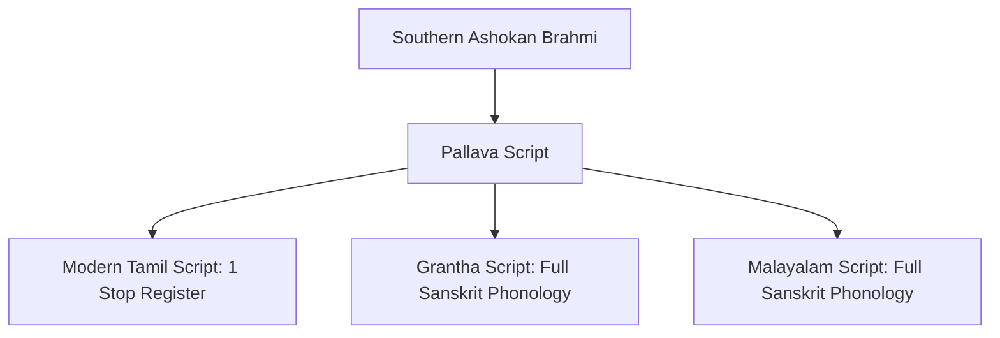

Transliterating Sanskrit between scripts is often treated as a simple character-by-character string replacement problem. For Vedic Sanskrit, this simplistic approach causes immediate text corruption.

`vyasa-lipi` implements an **Intermediate Representation (AST)** architecture designed around the following linguistic invariants:

1. **Lossless Round-Trip Guarantee**: Transliterating A → B → A must produce byte-identical text for any pair of supported scripts.
2. **Suprasegmental Pitch Accent (*Svara*) Fidelity**: Vedic tones (*Udātta*, *Anudātta*, *Svarita*, *DīrghaSvarita*) must be faithfully mapped across scripts.
3. **Strict Roman Separation**: ISO 15919 and IAST are distinct linguistic standards and must never be conflated.
4. **Phonological Expressiveness**: Target scripts must preserve all four stop registers (k, kh, g, gh) to prevent semantic collapse.

---

## 1. The Brahmic Abugida Architecture

All major indigenous scripts of South Asia (Devanagari, Telugu, Kannada, Grantha, Malayalam, Bengali) belong to the **Brahmic script family**. Unlike alphabets (where consonants and vowels have independent letters) or abjads (where vowels are omitted), Brahmic scripts are **abugidas**:

```text
Consonant Base (inherent short 'a')
        ├── With Dependent Vowel Mark (Mātrā):  क + ो  ⟶  को (ko)
        ├── With Virāma (Halanta):               क + ्  ⟶  क् (k)
        └── In Consonant Cluster (Saṁyoga):     क + ् + ष + े  ⟶  क्षे (kṣe)
```

### The Akṣara Token Intermediate Representation

`vyasa-lipi` parses all scripts into a structured phonemic AST rather than executing regex chains:

```rust
pub struct AksharaToken {
    pub initial_consonants: Vec<Consonant>,
    pub vowel: Option<Vowel>,
    pub is_virama: bool,
    pub ayogavaha: Option<Ayogavaha>,
    pub svara: Option<Svara>,
}
```

By decomposing text into discrete `AksharaToken` instances:
- Consonant conjuncts (*saṁyogākṣara*) are preserved across complex scripts (e.g. Grantha ligatures, Malayalam *chillu* forms, Bengali conjuncts).
- Vedic combining accents are attached directly to the vocalic nucleus of the syllable, guaranteeing that they never become orphan non-spacing marks.

---

## 2. Vedic Pitch Accents (Svara) Across Scripts

In the Vedic oral tradition, pitch accent (*Svara*) is phonemic: changing the tone changes the meaning of the word (e.g., Pāṇini *Aṣṭādhyāyī* 1.2.29–32 and Patañjali's *Mahābhāṣya* on the danger of misplacing an accent: *śabdo hīnaḥ svarato varṇato vā...*).

### The Four Primary Vedic Svaras

| Svara Name | Musical / Acoustic Pitch | Devanagari Glyph | Unicode Codepoint | Telugu / Kannada Representation |
|:---|:---|:---:|:---:|:---|
| **Udātta** | High (acute) | Unmarked | — | Unmarked |
| **Anudātta** | Low (grave) | Subscript bar `_` | `U+0952` | Subscript bar (`\u{0952}` or script equivalent) |
| **Svarita** | Falling circumflex | Superscript vertical stroke `\|` | `U+0951` | Superscript vertical stroke (`\u{0951}`) |
| **DīrghaSvarita** | Long falling circumflex | Double superscript stroke `\|\|` | `U+1CDA` | Double vertical stroke (`\u{1CDA}`) |

### Cross-Script Svara Preservation

Most Indic script engines strip accents when converting to South Indian scripts because Telugu and Kannada fonts historically used distinct code ranges.

In `vyasa-lipi`, combining marks `U+0951` and `U+0952` are canonical Vedic combining marks specified by the Unicode standard to apply across all Indic abugidas:

```bash
# Devanagari:
अ॒ग्निमी॑ळे पु॒रोहि॑तम्

# Transliterated to Telugu:
అ॒గ్నిమీ॑ళే పు॒రోహి॑తమ్

# Transliterated to Kannada:
ಅ॒ಗ್ನಿಮೀ॑ಳೆ ಪು॒ರೋಹಿ॑ತಮ್
```

Notice that both the *Anudātta* under-bar (`\u0952`) on *a* and *ro*, and the *Svarita* stroke (`\u0951`) on *mī*, remain intact and correctly positioned over the respective Telugu and Kannada aksharas.

---

## 3. Strict ISO 15919 vs IAST

One of the most persistent errors in digital Sanskrit tools is treating **IAST** (International Alphabet of Sanskrit Transliteration) and **ISO 15919** as synonymous.

### Key Divergences

| Phonetic Category | Sanskrit Sound | Strict ISO 15919 | Standard IAST | Why the Difference Matters |
|:---|:---:|:---:|:---:|:---|
| **Vocalic Liquid R** | ऋ | `r̥` (under-ring) | `ṛ` (under-dot) | Under-ring designates vocalic syllabicity. Under-dot is reserved for retroflex consonants (ṭ, ḍ, ṣ). |
| **Long Vocalic R** | ॠ | `r̥̄` (ring + macron) | `ṝ` (dot + macron) | |
| **Vocalic Liquid L** | ऌ | `l̥` (under-ring) | `ḷ` (under-dot) | **Critical**: In IAST, `ḷ` is ambiguous—it is used for *both* vocalic liquid ऌ and the Vedic retroflex consonant ळ! |
| **Dravidian Short E** | ऎ (Telugu/Kannada) | `e` | N/A | ISO 15919 cleanly distinguishes short `e` from long `ē`. |
| **Sanskrit Long E** | ए | `ē` (with macron) | `e` (bare) | In Classical Sanskrit, *e* is always long; IAST leaves it bare, which fails when transcribing South Indian texts. |
| **Dravidian Short O** | ऒ | `o` | N/A | |
| **Sanskrit Long O** | ओ | `ō` (with macron) | `o` (bare) | |
| **Vedic Lateral Flap** | ळ | `l̤` (under-diaeresis) | `ḷ` | ISO 15919 prevents confusion with vocalic ऌ. |

`vyasa-lipi` enforces this distinction strictly:
- If target is `iso15919`, it emits `r̥`, `r̥̄`, `l̥`, `ē`, `ō`, and `l̤`.
- If target is `iast`, it emits `ṛ`, `ṝ`, `ḷ`, `e`, and `o`.

---

## 4. Grantha vs Tamil Phonology

Users often ask: *Why does `vyasa-lipi` support Grantha, but not standard Tamil?*

The answer lies in the deep history of South Indian epigraphy and phonology.

### The Dravidian Consonant Collapse in Tamil

The Classical Tamil script (evolved from Tamil-Brahmi) was engineered strictly for the phonetic structure of Old Tamil, as codified in the *Tolkāppiyam*.

In Dravidian phonology, there are **no distinct phonemic registers** for voiced or aspirated stops:

- **Sanskrit 4-register stops**: `k`, `kh`, `g`, `gh`
- **Tamil phonemic inventory**: `k` (க)

When Sanskrit is transcribed into unaugmented Tamil:
- *Govinda* becomes *Kovinta* (கோவிந்த).
- *Bhārata* becomes *Pārata* (பாரத).
- *Dharma* becomes *Taruma* (தரும).

### Why Lossy Mode Violates vyutils Invariants

If `vyasa-lipi` transliterated Devanagari to standard Tamil:

- धर्म ⟶ தர்ம ⟶ तर्म
- भारत ⟶ பாரத ⟶ पारात

The round-trip fidelity is destroyed because information was lost (gh, g, kh → k).

### The Solution: Grantha (𑌗𑍍𑌰𑌨𑍍𑌥)

In the 6th–7th century CE, the Pallava dynasty recognized this exact problem: they needed to write sacred Sanskrit texts in the Tamil-speaking region without losing phonetic distinctions.

They developed **Grantha**, a sister script to Tamil sharing the same aesthetic ductus, but retaining the complete 33-consonant, 4-stop inventory of Sanskrit.



In `vyasa-lipi`, **Grantha is the canonical script for transcribing Sanskrit in the Tamil cultural sphere** (Unicode range `11300..1137F`).

---

## 5. Computational ASCII Schemes

For programmatic pipelines, command-line search, and database indexing where Unicode combining marks can be awkward, `vyasa-lipi` provides three standard ASCII transliterations:

1. **SLP1 (Sanskrit Library Phonetic Basic)**:
   - 1:1 single-character mapping (every Sanskrit sound maps to exactly one ASCII character).
   - Capital letters denote aspirates and long vowels (A = ā, K = kh, G = gh).
   - Standard in the Cologne Digital Sanskrit Dictionaries.
2. **Harvard-Kyoto (HK)**:
   - Widely used by Western Indologists.
   - Long vowels capitalized (A, I, U). Sibilants: z = ś, S = ṣ.
3. **WX**:
   - Developed at IIT Kanpur and University of Hyderabad.
   - Specifically engineered for Indian Language to Indian Language Machine Translation (ILMT) algorithms.

---

## Next Steps

- Try hands-on transliterations: **[How-To Guide: Transliterating Sanskrit](file:///Users/anand/Projects/project-vyasa/vyutils/documentation-site/src/content/docs/guides/transliterate-sanskrit.md)**
- Review CLI arguments and script flags: **[vyasa-lipi Reference](file:///Users/anand/Projects/project-vyasa/vyutils/documentation-site/src/content/docs/reference/vyasa-lipi.md)**
