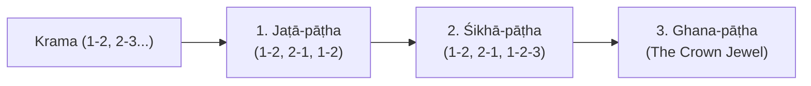

# Vedic Recitation & Phonological Systems: Questions & Answers

This document records architectural, linguistic, and computational questions and answers regarding Sanskrit computational engines, Vedic recitation pāṭhas, and pre-Pāṇinian phonetic systems in Project Vyasa.

---

## Q1: Am I allowed to paste Saṃhitā text as Pada-pāṭha input?

**Answer: Strictly speaking, no.**

### Explanation:
1. **Saṃhitā is already fused**:
   - In Saṃhitā, words have merged through euphonic combination (*sandhi*), consonants have assimilated, vowels have coalesced, accents have shifted, and compounds are unbroken strings.
   - Example: Saṃhitā reads: `अ॒ग्निमी॑ळे पु॒रोहि॑तं य॒ज्ञस्य॑...`
2. **Krama requires isolated pre-sandhi word boundaries**:
   - Step 1 (1-2) pairs Word 1 (`अ॒ग्निम्`) and Word 2 (`ई॒ळे॒`).
   - Step 2 (2-3) pairs Word 2 (`ई॒ळे॒`) and Word 3 (`पु॒रोहि॑तम्`).
   - If an engine receives only the fused Saṃhitā string `अ॒ग्निमी॑ळे`, it cannot know where Word 1 ends and Word 2 begins. It cannot extract `ई॒ळे॒` to launch Step 2.
3. **Compound analysis (*Samāsa-vigraha*) is concealed**:
   - The Parigraha clause for compounds (`रत्न॒धात॑ममिति॑ रत्न॒-धात॑मम्`) requires knowing the internal analytical boundary (`रत्न॒-धात॑मम्`). Saṃhitā text (`रत्न॒धात॑मम्`) completely conceals whether a word is a compound or where its internal joints lie.

> [!NOTE]
> In Vedic phonetic tradition (*Ṛgveda-Prātiśākhya* and Yāska's *Nirukta*):  
> **"Padāni saṃhitāyāḥ prakṛtiḥ"** — *The Padas are the natural foundational material from which the Saṃhitā and all permutation pāṭhas (Krama, Jaṭā, Ghana) are derived.*  
> You cannot permute what has not yet been parsed into individual words.

---

## Q2: What does it take to "convert" from Saṃhitā to Pada-pāṭha?

**Answer: Converting Saṃhitā to Pada-pāṭha is one of the classic hard inverse problems in Sanskrit computational linguistics.**

While the forward direction ($\text{Pada} \to \text{Saṃhitā}$) is 100% deterministic, the reverse direction is **lossy and highly ambiguous**.

### The 4 Technical Challenges:
1. **Ambiguous Vowel Coalescence**:
   - `गच्छत्यासनम्` $\longrightarrow$ Could be `गच्छति + आसनम्` or `गच्छती + आसनम्` (feminine participle).
   - Long `ā` coalescence: `हिमालयः` $\longrightarrow$ Is it `हिम + आलयः` or `हिमा + लयः`?
2. **Undoing Consonant Neutralization & Resetting Retroflexion (*Nati*)**:
   - In Saṃhitā: `इन्द्रो॑ णो॒` $\longrightarrow$ In Pada-pāṭha: Must know to de-retroflex `णः` back to dental `नः` (`इन्द्रः॑ । नः॒`).
   - In Saṃhitā: `स दे॒वान्` $\longrightarrow$ In Pada-pāṭha: Must know to restore the dropped visarga on `सः` (`सः । दे॒वान्`).
3. **Compound Splitting (*Samāsa-viccheda*)**:
   - Identifying internal component joints (inserting hyphens/avagraha: `पु॒रःऽहि॑तम्`, `र॒त्न॒ऽधात॑मम्`).
4. **Accent Reconstruction**:
   - When an Udātta and Anudātta merge into a Svarita or Dīrgha Svarita in Saṃhitā, determining which syllable had the original primary Udātta requires full morphological analysis of verb prefixes (*upasargas*) and noun cases (*sup/tiṅ*).

### Recommended Strategy for Project Vyasa:
- **Canonical Lookup (Instant & 100% Accurate)**: For the Ṛgveda, our local pipeline at `sa.wikisource.org/data/processed/rigveda` already has all 10,547 verses aligned in both `padapatha` and `samhita`. In Sanskrit Studio, when a user selects or pastes a known mantra (e.g. RV 1.1 or Puruṣa Sūkta), we can auto-lookup the authentic Śākalya Pada-pāṭha.
- **Algorithmic Segmenter (For General/Classical Sanskrit)**: For non-canonical Sanskrit, leverage a beam-search segmenter (such as `vidyut-sandhi`'s compound splitter) with morphological dictionary constraints.

---

## Q3: What should we tackle after Krama-pāṭha?

**Answer: Jaṭā-pāṭha first, then Ghana-pāṭha.**

In the Vedic recitation hierarchy:
$$\text{Saṃhitā} \implies \text{Pada} \implies \mathbf{Krama} \implies \mathbf{Jaṭā} \implies \text{Mālā} \implies \text{Śikhā} \dots \implies \mathbf{Ghana}$$



### 1. Jaṭā-pāṭha (जटापाठ - "Matted Hair") — *Immediate Next Step*
- **Formula**:
  $$\text{Step 1: } 1\text{-}2,\; 2\text{-}1,\; 1\text{-}2 \quad\mid\quad \text{Step 2: } 2\text{-}3,\; 3\text{-}2,\; 2\text{-}3 \quad\dots$$
- **Engine Requirement**: Combines forward sandhi ($1\text{-}2$) with **reverse sandhi** ($2\text{-}1$):
  - Forward: `अ॒ग्निम्` + `ई॒ळे॒` $\to$ `अ॒ग्निमी॑ळे`
  - Reverse: `ई॒ळे॒` + `अ॒ग्निम्` $\to$ `ई॒ळे॒ऽग्निम्` (Avagraha elision: $e + a \to e'$)
  - Return: `अ॒ग्निम्` + `ई॒ळे॒` $\to$ `अ॒ग्निमी॑ळे`

### 2. Ghana-pāṭha (घनपाठ - "The Bell / Dense Permutation") — *The Ultimate Milestone*
- **Formula**:
  $$1\text{-}2,\; 2\text{-}1,\; 1\text{-}2\text{-}3,\; 3\text{-}2\text{-}1,\; 1\text{-}2\text{-}3 \quad\mid\quad 2\text{-}3,\; 3\text{-}2,\; 2\text{-}3\text{-}4,\; 4\text{-}3\text{-}2,\; 2\text{-}3\text{-}4$$
- **Why**: This is the supreme status symbol in Vedic scholarship. A scholar who masters this receives the revered lifetime title **Ghanapāṭhin** (घनपाठी).

---

## Q4: Is there another pre-Pāṇinian system to tackle based on frequency of use?

**Answer: Yes: The *Taittirīya-Prātiśākhya* (Kṛṣṇa Yajurveda).**

### Living Practitioner Volume Across Traditions:
```text
Vedic Traditions by Living Practitioner Volume:
1. Kṛṣṇa Yajurveda (Taittirīya Śākhā)  ████████████████████ ~75% - 80% (Highest Living Usage)
2. Ṛgveda (Śākala Śākhā)               █████                 ~15%
3. Śukla Yajurveda (Mādhyandina/Kāṇva) ███                   ~5% - 8%
4. Sāmaveda (Kauthuma/Jaiminīya)       █                     ~1% - 2%
5. Atharvaveda (Śaunaka/Paippalāda)    ▏                     <0.5%
```

### Why Kṛṣṇa Yajurveda (Taittirīya) is the Top Candidate:
1. **Everyday Liturgical Dominance**:
   - The vast majority of mantras chanted in South Indian temples, smārta homas, and daily pujas are Taittirīya texts:
     - **Śrī Rudram** (*Namakam* & *Camakam*)
     - **Camapraśna**
     - **Mānyu Sūkta**, **Durgā Sūkta**, **Medhā Sūkta**
     - **Taittirīya Upaniṣad** (*Śīkṣāvallī*, *Ānandavallī*, *Bhṛguvallī*)
     - The Yajurvedic recension of the **Puruṣa Sūkta**
2. **Unique Phonological Rules (*Taittirīya-Prātiśākhya*)**:
   - **Vaidika Anusvāra & Gomukha (`ँ` / `೵` / `ᳵ`)**: Nasal transformations before semivowels (*anunāsika / raṅga* sūtras).
   - **Abhinihita Sandhi & Avagraha**: Distinct rules for whether initial `a-` is elided or pronounced with hiatus.
   - **Three-Mātrā Pluta Accents (`३`)**: Characteristic melodic prolongations in Taittirīya chants.

### Comparison with other Vedas:
- **Śukla Yajurveda (*Vājasaneyi-Prātiśākhya*)**: Prevalent in North India; characteristic shifts like `य` $\to$ `ज` and `ष` $\to$ `ख` (*khasya ṣaḥ*).
- **Sāmaveda (*Ṛktantra* & *Puṣpasūtra*)**: A musical singing system using 7 musical notes (`१, २, ३...`) and melodic insertions (*stobhas* like `हाउ, होयि`). This is an audio-musical synthesis domain rather than a textual permutation engine.

---

## Q5: How does Krishna Yajurveda (Taittirīya Śākhā) phonology differ from Rigvedic and Pāṇinian phonetics?

**Answer: It introduces four fundamental phonological concepts codified in the *Taittirīya-Prātiśākhya* (TPr):**

### 1. Dual Coordinate System: Active Articulator (*Karaṇa*) vs. Passive Place (*Sthāna*)
- Classical Pāṇinian grammar primarily references the passive locus (*Sthāna*—teeth, palate, velum).
- The TPr (Chapter 2) requires a dual coordinate system distinguishing the static locus from the moving organ (*Karaṇa*):
  - Velars (*k..ṅ*): Articulated by **Jihvāmādhya** (tongue dorsum/middle) against the velum (TPr 2.35).
  - Palatals (*c..ñ, y, ś*): Articulated by **Jihvopamadhya** (tongue blade/edges) against the hard palate (TPr 2.36).
  - Retroflexes (*ṭ..ṇ, r, ṣ, ḷ*): Articulated by **Prativeṣṭitam** (curled tongue tip) against the roof of the palate (TPr 2.37).
  - Dentals (*t..n, l, s*): Articulated by **Jihvāgram** (tip of tongue) against tooth roots (TPr 2.38).
  - Bilabials (*p..m*) and Dentolabials (*v*): Articulated by **Adharoṣṭha** (lower lip) (TPr 2.39, 2.43).
  - Jihvāmūlīya (*ẖ*): Articulated by **Jihvāmūla** (tongue root) (TPr 2.44).
  - Vowels: Produced with **Hanu** (open vocal tract without consonantal contact) (TPr 2.12).
  - Pure Nasals (*Nāsikya*, *Anusvāra*): Articulated in **Nāsikābila** (nasal cavity aperture) (TPr 2.50).

### 2. The 8-Fold Svarita Accent Taxonomy (TPr Chapter 20)
While classical Sanskrit distinguishes only Udātta, Anudātta, and Svarita, the TPr classifies Svarita into 8 distinct varieties split across **Nitya** (independent/stem) and **Enclitic** (post-Udātta dependent):
1. **Jātya** (जात्य): Inherent stem circumflex with semivowels (*kanyā̀*, *svàr*).
2. **Kṣaipra** (क्षैप्र): High vowel $\to$ semivowel before dissimilar vowel (*ví + abravīt* $\to$ *vyàbravīt*).
3. **Abhinihita** (अभिनिहित): Elision/absorption of *a-* after *e/o* (*té + abruvan* $\to$ *té 'bruvan*).
4. **Praśliṣṭa** (प्रश्लिष्ट): Contraction of two *i/ī* (*diví + iva* $\to$ *divī̀va*).
5. **Tairovyañjana** (तैरोव्यञ्जन): Standard post-Udātta enclitic across consonants (*agním īḷe*).
6. **Tairovirāma** (तैरोविराम): Svarita crossing a caesura or pause boundary.
7. **Pādavṛtta** (पादवृत्त): Hiatus where Sandhi is suspended without coalescence (*pra ugam*).
8. **Tathābhāvya** (तथाभाव्य): Contextual adoption of circumflex contour.

### 3. Consonant Gemination / Doubling (*Dvirvacana / Dvitva*) (TPr Chapter 14)
Authentic Taittirīya chanting strictly doubles consonants under specific conditions:
- **TPr 14.1**: Post-vocalic consonants beginning a conjunct double (*aśvaḥ* $\to$ *aśśvaḥ*, *agnim* $\to$ *aggnim*).
- **TPr 14.4**: Any consonant preceded by *r* or *h* doubles (*arkaḥ* $\to$ *arkkaḥ*, *dharmaḥ* $\to$ *dharmmaḥ*, *śīrṣan* $\to$ *śīrṣṣan*).

### 4. *Raṅga* and *Nāsikya* Ayogavāhas (TPr Chapter 17)
- **Raṅga**: When word-final *n* or *m* precedes sibilants or semivowels, a melodic nasal prolongation occurs, lasting $1.5$–$2.0$ mātrās of vocalic tone followed by $0.5$ mātrā of pure nasal resonance (e.g. TS 1.1.1: *mahā̐ asi*, Camakam: *yā̐strīn*).
- **Nāsikya**: A distinct pure nasal Ayogavāha resonant sound produced solely in the nasal cavity without oral contact.

### 5. Project Vyasa Implementation
- Implemented natively in `vyasa-phonetics::taittiriya`.
- Driven by a version-controlled test corpus (`crates/vyasa-phonetics/tests/data/kyv_corpus.json`) across the 3 core Taittirīya texts (*Taittirīya Saṃhitā*, *Taittirīya Upaniṣad*, and *Puruṣa Sūkta*).
- Validated via `cargo test -p vyasa-phonetics --test data_driven_taittiriya`.
- Exposed to WebAssembly and TypeScript via `@project-vyasa/sanskrit-wasm`.

